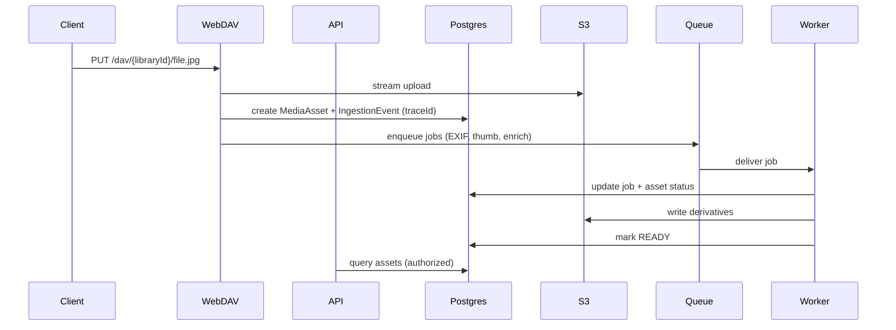

# MemoriaHub Architecture

## High-level design
MemoriaHub is a monorepo with three core runtimes: 
- **web**: React UI
- **api**: REST API + WebDAV ingestion
- **worker**:  background processing pipeline

## System diagram

```mermaid
graph TD
  U[User  Sync Client] -->|HTTPS| N[Nginx  Reverse Proxy]
  N -->|root path| W[Web UI (React)]
  N -->|api path| A[API Service (Node)]
  N -->|dav path| D[WebDAV Endpoint]

  A --> P[(PostgreSQL)]
  D --> S[(S3 Object Storage)]
  D --> P

  A --> Q[(Job Queue / DB-backed queue)]
  Q --> R[Worker Service]

  R --> P
  R --> S

  subgraph Observability
    OT[OpenTelemetry] --> PR[Prometheus]
    OT --> J[Jaeger]
    OT --> L[Loki]
    G[Grafana] --> PR
    G --> J
    G --> L
  end

  A --> OT
  D --> OT
  R --> OT
```

## Key architectural decisions

### 1) Single-domain routing
- UI: `https://<domain>/`
- API: `https://<domain>/api`
- WebDAV: `https://<domain>/dav`

This reduces CORS complexity and keeps deployments simple. 

### 2) Event-driven processing pipeline
Uploads create an **IngestionEvent** and enqueue **ProcessingJobs**. A fallback reconciler handles orphaned work. 

### 3) Storage abstraction
A `StorageAdapter` interface supports:
- AWS S3 (initial)
- S3-compatible endpoints (MinIO)
- (future) local/NAS replication targets

### 4) Service boundaries
- API handles auth, libraries, metadata APIs, search, and job enqueue.
- WebDAV endpoint validates uploads and emits ingestion events.
- Worker performs CPU-heavy work and retries safely. 

## Data model (conceptual)

### Core entities
- **User**:  OAuth identity mapping
- **Library**:  owner, visibility, members
- **MediaAsset**: object storage keys, metadata, status
- **IngestionEvent**: upload tracking + client details
- **ProcessingJob**: pipeline steps, attempts, last error
- **Person**: known person label + embedding references
- **Tag**: object/scene labels + confidence
- **Location**: normalized place records

### Status lifecycle
- `UPLOADED` → `METADATA_EXTRACTED` → `DERIVATIVES_READY` → `ENRICHED` → `INDEXED` → `READY`

## Ingestion pipeline (required trace)



## APIs (categories)
- Auth: `/api/auth/*`
- Libraries: `/api/libraries/*`
- Media: `/api/media/*`
- Search: `/api/search`
- Chat retrieval: `/api/chat/query`
- Admin: `/api/admin/*`

## Configuration
- All config via env vars + `.env` per service
- No config files with secrets committed

## Deployment (Docker Compose)
- `infra/compose/dev.compose.yml` for local
- `infra/compose/prod.compose.yml` for VPS
- `infra/observability/*` for Prometheus/Grafana/Loki/Jaeger

## Diagrams
- Keep diagrams in `docs/diagrams/`.
- Prefer Mermaid for agent-editable diagrams.