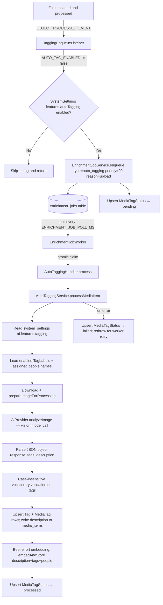

# AI Auto-Tagging — End-to-End Reference

| Field | Value |
|-------|-------|
| **Version** | 1.2 |
| **Last Updated** | June 2026 |
| **Status** | Implemented |

---

## Table of Contents

1. [Overview and User-Facing Behavior](#1-overview-and-user-facing-behavior)
2. [Architecture and Data Flow](#2-architecture-and-data-flow)
3. [Data Model](#3-data-model)
4. [Provider and Vision Integration](#4-provider-and-vision-integration)
5. [Configuration and Environment Variables](#5-configuration-and-environment-variables)
6. [API Endpoints](#6-api-endpoints)
7. [Operations](#7-operations)

**Related spec:** [Semantic Search](semantic-search.md) — pgvector embedding stored at the end of each tagging job.

---

## 1. Overview and User-Facing Behavior

AI auto-tagging automatically assigns descriptive tags and generates a brief description for uploaded photos using a vision language model. A single vision call produces both outputs as one JSON object `{"tags", "description"}`. The model evaluates each photo against a **global vocabulary** of tag labels managed by the admin, then adds matching labels as regular circle-scoped tags and writes the description directly onto the `media_items` row.

**Core capabilities:**

- Tag photos automatically on upload when enabled globally (system setting `features.autoTagging`, default off). Previously a per-circle opt-in; as of migration `20260621050000_drop_circle_feature_flags` this is a global toggle. **Note:** this migration dropped the per-circle `auto_tagging_enabled` column — any previously-enabled circles lost that setting and an Admin must re-enable the feature globally.
- Generate a `description` (1–3 sentences) alongside tags in the same vision call.
- Inject the names of people already assigned to faces in the photo into the prompt so the description can reference them by name.
- Overwrite `description` on every successful run — it always reflects the latest model output. On a parse failure, the existing description is left untouched and tags are treated as empty.
- Use any configured AI provider (Anthropic, OpenAI) with admin-selected model.
- Draw only from an admin-defined global vocabulary — the model cannot invent tag labels.
- Allow circle collaborators to trigger a per-item re-run from the media drawer.
- Allow admins to backfill existing photos across all circles via a global admin endpoint, with optional date-range scoping and a force flag to reprocess already-tagged items. Backfilling also produces embeddings for any item that runs through the pipeline.
- Generate a text embedding from description + tags + people names at the end of each successful run and store it in `media_item_embedding` for semantic search (best-effort; embedding failures never fail the tagging job). See [Semantic Search](semantic-search.md) for the full embedding and search architecture.
- Track per-item status (`not_processed`, `pending`, `processing`, `processed`, `failed`) for monitoring and UI display.

Auto-tagging is deliberately decoupled from the synchronous upload path. Uploads complete immediately; image analysis runs in the background via the generic `enrichment_jobs` queue. See **[docs/specs/enrichment-queue.md](enrichment-queue.md)** for the full queue architecture.

---

## 2. Architecture and Data Flow

### Upload Path



### Priority Ordering

| Trigger | `reason` | `priority` |
|---------|----------|------------|
| Per-item re-run | `rerun` | 0 (highest) |
| On upload | `upload` | 20 |
| Backfill | `backfill` | 100 (lowest) |

The worker claims jobs ordered by `priority ASC, createdAt ASC`, so re-runs process before fresh uploads, which process before backfill work.

### Idempotent Enqueue

`EnrichmentJobService.enqueue` checks for an existing `pending` or `running` job with the same `type` + `mediaItemId` before inserting. If one exists, it returns the existing job without creating a duplicate.

### Worker Retry Logic

The `EnrichmentJobWorker` retries failed jobs up to **3 attempts** total (`MAX_ATTEMPTS = 3`). If `AutoTaggingService.processMediaItem` throws (e.g. transient provider error), the worker resets the job to `pending` for the next tick. After the third failure the job is marked `failed` and will not auto-retry. Manual retry is available via `/admin/jobs`.

Failures that are not retryable — missing media item, wrong media type, provider/model not configured, credential resolution error — are detected early in `processMediaItem`, the status row is set to `failed` with `lastError`, and the function returns normally without throwing (so the worker marks the job `succeeded` and does not retry).

---

## 3. Data Model

### `tag_labels` — Global Vocabulary

The admin-managed list of labels the AI may assign. Unique globally (not per-circle).

| Column | Type | Notes |
|--------|------|-------|
| `id` | UUID PK | |
| `name` | String UNIQUE | Case-sensitive canonical label |
| `enabled` | Boolean | Default `true`; disabled labels are excluded from prompts |
| `created_at` | Timestamptz | |
| `updated_at` | Timestamptz | |

### `media_tag_status` — Per-Item Processing Status

One row per `media_item`, tracking where the item is in the pipeline.

| Column | Type | Notes |
|--------|------|-------|
| `id` | UUID PK | |
| `media_item_id` | UUID UNIQUE | FK → `media_items` (cascade delete) |
| `circle_id` | UUID | FK → `circles` (cascade delete) |
| `status` | `MediaTagStatusType` | See enum below |
| `provider_key` | String? | Provider that last processed this item |
| `model_version` | String? | Model that last processed this item |
| `tag_count` | Int | Number of tags assigned by the last successful run |
| `processed_at` | Timestamptz? | Timestamp of last successful completion |
| `last_error` | String? | Error message from the last failed attempt |
| `created_at` | Timestamptz | |
| `updated_at` | Timestamptz | |

**`MediaTagStatusType` enum values:**

| Value | Meaning |
|-------|---------|
| `not_processed` | No job has ever been enqueued (returned as a virtual default — no DB row exists) |
| `pending` | Job is in the queue waiting to run |
| `processing` | Worker has claimed the job and is actively running |
| `processed` | Completed successfully; `tag_count` reflects the result |
| `failed` | All attempts exhausted or non-retryable error; see `last_error` |

### `features.autoTagging` — Global System Setting

Boolean stored in the `system_settings` JSONB column under the key `global`, at path `.features.autoTagging` (default `false`). When `false`, `TaggingEnqueueListener` skips enqueueing for all uploaded photos, and `POST /api/admin/tagging/backfill` rejects the request with `400 Bad Request`.

The previous per-circle `Circle.auto_tagging_enabled` column was dropped in migration `20260621050000_drop_circle_feature_flags`. The listener now calls `SystemSettingsService.isFeatureEnabled('autoTagging')` instead of reading the circle flag.

### AI Tagging Feature Setting

Stored as a nested path in the `system_settings` JSONB column under the key `global`:

```json
{
  "ai": {
    "features": {
      "tagging": {
        "provider": "anthropic",
        "model": "claude-opus-4-5"
      }
    }
  }
}
```

Set via `PUT /api/ai/features/tagging`. Read by `AutoTaggingService` at job-processing time.

### Tag Storage

AI-assigned tags are stored as `tags` and `media_tags` rows. The `media_tags.source` column (`MediaTagSource` enum: `manual` | `ai`, default `manual`) distinguishes who applied the tag. The `tags.added_by_id` is set to the media item's `added_by_id` (the uploader), not a system account.

Tag name uniqueness is enforced per `(circle_id, name)`.

### Tag Sources and Reconciliation

Every `MediaTag` row carries a `source` value:

| Value | Set by | Protected from AI reconciliation? |
|-------|--------|----------------------------------|
| `ai` | Auto-tagging service | No — AI re-runs may remove it |
| `manual` | User tag operations (`attachTags`, `bulkTags` add) | Yes — never touched by AI |

**AI tagging is authoritative over its own tags.** Each auto-tagging run opens a transaction that:
1. Deletes all `source='ai'` `MediaTag` rows for the item whose tag name is no longer in the model's current output.
2. Upserts the current output labels with `source='ai'` — but never downgrades an existing `manual` tag to `ai` (the upsert `update` is a no-op on conflict).

This means:
- Re-running auto-tagging reflects the model's current judgment exactly: stale AI labels are removed, new ones are added.
- An empty model response removes all AI tags from the item.
- Vocabulary deletes/renames are reflected on the next re-run (AI tags for the old name are pruned when the name no longer appears in the output).

**Manual operations promote AI tags.** When a user manually adds a tag that already exists as `source='ai'` on the same item, `attachTags` and `bulkTags` set `source='manual'` on the existing row. The tag is then permanently protected from future AI reconciliation, even if the model stops returning that label.

**Deleting a vocabulary label strips its AI-applied instances immediately.** `TagLabelsService.remove` runs a transaction that deletes the `TagLabel` row, then deletes all `source='ai'` `MediaTag` rows matching the label name (case-insensitive) across all circles, then cleans up any now-empty `Tag` rows. Manual instances of that same name are preserved.

---

## 4. Provider and Vision Integration

### `AiProvider.analyzeImage`

```typescript
interface AnalyzeImageRequest {
  model: string;
  system?: string;
  prompt: string;
  /** Raw base64-encoded image data — no `data:` URI prefix. */
  imageBase64: string;
  /** MIME type, e.g. 'image/jpeg' */
  mimeType: string;
}

interface AiProvider {
  analyzeImage(creds: AiProviderCredentials, req: AnalyzeImageRequest): Promise<string>;
}
```

`analyzeImage` is a non-streaming, single-turn vision call. It returns the model's full text response as a string. The caller is responsible for JSON-parsing the response.

### Provider Implementations

| Provider | Implementation |
|----------|---------------|
| `anthropic` | `client.messages.create` with `max_tokens: 1024`; image sent as `base64` source block; system prompt passed as top-level `system` field |
| `openai` | `client.chat.completions.create` with `max_tokens: 1024`; image sent as `image_url` with `data:` URI in the user message; system prompt as a `system` role message |

### Prompt Design

**System prompt** (fixed):
> You are an image analysis assistant. Your job is to analyze the given image and return a JSON object with two keys: "tags" and "description". "tags" must be a JSON array of strings — each string must exactly match one of the labels in the provided allowed list; return an empty array if none apply. "description" must be a brief 1–3 sentence description of the photo. Respond with ONLY a JSON object with those two keys — no explanation, no code fences, no extra text.

**User prompt** (constructed per job):
```
Analyze this image and return a JSON object with two keys: "tags" and "description".

"tags": an array of applicable labels from the following allowed list. Only choose labels that clearly
apply. Return an empty array if none apply.
"description": a brief 1-3 sentence description of the photo.

Allowed labels:
<label1>
<label2>
...

Example response: {"tags": ["label1", "label2"], "description": "Two adults and a child are seated around a picnic table in a sunny backyard."}
```

If named people are already assigned to faces detected in the photo, the prompt appends:

> The following named people appear in this photo: Alice, Bob. Mention them by name in the description where appropriate.

Only `enabled` tag labels are included in the allowed list, sorted alphabetically by name.

### Response Parsing and Validation

The raw response string is cleaned of any Markdown code fences, then the first JSON object (`{...}`) is extracted with a regex and parsed.

**Tags:** the `tags` array is filtered to strings, then validated case-insensitively against the allowed label set. Unknown labels are silently dropped. Matching labels are normalized back to their canonical casing as stored in `tag_labels.name`. Duplicates are deduplicated before upsert.

**Description:** extracted as a string, trimmed, and capped at 8 192 chars. An empty or missing string is stored as `null`.

**Parse failure semantics:** if the response cannot be parsed as a valid JSON object with the expected shape (`parseOk = false`), the existing `description` on the `media_items` row is left untouched and tags are treated as empty for this run. The tagging status is still set to `processed` in this case (the job does not fail or retry). Successful parses always overwrite the field.

### Image Preprocessing and Provider Limits

#### Preprocessing pipeline

Before calling the vision model, the downloaded image passes through three steps in order:

1. **EXIF-orientation correction** — `prepareImageForProcessing` calls `sharp().rotate()` so portrait photos stored sideways are upright before analysis.
2. **Downscale to fit `TAG_MAX_IMAGE_DIM`** — the long edge is constrained to `TAG_MAX_IMAGE_DIM` px (default **1568**) using `fit: 'inside'` with `withoutEnlargement: true`. Images already smaller than the limit are not upscaled.
3. **Re-encode to JPEG at quality 90** — the output is always `image/jpeg`, regardless of the original format.

This normalizes orientation, format, and dimensions before anything reaches the provider.

#### Provider image limits

The following are as-of-implementation provider constraints; verify against current provider documentation if exact numbers matter.

**Anthropic (Claude):**
- Supported formats: JPEG, PNG, GIF, WebP. HEIC and TIFF are not natively accepted by the provider — but see the HEIC decode note below: MemoriaHub now normalizes HEIC to JPEG before the provider ever sees it, so this constraint no longer bites in practice for HEIC. TIFF is still not decoded and still hits the fallback path.
- Per-image data limit: approximately 5 MB.
- Images with a long edge exceeding 1568 px are auto-downscaled server-side, so 1568 px is the effective sweet spot — sending larger images costs more tokens without improving quality.
- Token cost scales roughly with pixel area (~(w × h) / 750 tokens).

**OpenAI (GPT vision models):**
- Supported formats: JPEG, PNG, WebP, non-animated GIF.
- Per-image byte cap is larger than Anthropic's; the 4.5 MB code constant provides a safe upper bound for both providers.
- OpenAI applies internal resizing depending on the `detail` mode; vision token cost scales with image size.

#### Hardening and failure handling

The service implements three safeguards that produce a non-retryable `failed` status rather than letting an unprocessable image occupy retry slots:

**Happy path:** `prepareImageForProcessing` succeeds (returns `width > 0`). The prepared JPEG buffer is sent as `image/jpeg`.

**HEIC/HEIF now decodes successfully (issue #106):** `prepareImageForProcessing` (`packages/enrichment-compute/src/image/index.ts`) now falls back to an ffmpeg transcode when sharp's bundled libvips can't decode the input — this is the shared decode path auto-tagging already calls, so no change was needed in this handler or in `detectImageMime` (`apps/api/src/tagging/image-mime.util.ts`, unchanged). For a HEIC photo, `prepareImageForProcessing` internally transcodes to JPEG via ffmpeg and re-runs its normal pipeline, so it now returns `width > 0` on the happy path instead of `width: 0` — auto-tagging sees a normal prepared JPEG buffer and never falls into the MIME-sniffing branch below for HEIC specifically. See the HEIC/HEIF decode fallback note under "Writing an Image Enrichment Handler" in `CLAUDE.md` for the mechanism (ffmpeg-transcode, `FFMPEG_TIMEOUT_MS`-bounded, `memoriaHub-heic-*` temp files) and its cross-executor parity caveat vs. the containerized worker node's native libheif decode.

**Fallback path (sharp could not decode, and the ffmpeg transcode also failed or wasn't applicable):** `prepareImageForProcessing` returns `width: 0`, indicating decode failed even after the ffmpeg fallback (e.g. a genuinely corrupt file, or an unsupported format the fallback can't help with). The original bytes' MIME type is sniffed via `detectImageMime`, which checks magic bytes for JPEG, PNG, GIF, and WebP.
- If the detected MIME is `null` (TIFF, corrupt HEIC, or unknown) → status is set to `failed` with a clear `lastError`; the job is **not** retried.
- If the detected MIME is a supported type → the original bytes are sent with the **detected** MIME type. This fixes a previous bug where the fallback always set `image/jpeg` regardless of actual content.

**Byte-size cap:** After selecting the buffer (prepared or fallback), if `buffer.length > MAX_IMAGE_BYTES` (4,500,000 bytes — roughly 4.5 MB, giving headroom under Anthropic's ~5 MB limit) → status is set to `failed` with a size error; the job is **not** retried. `MAX_IMAGE_BYTES` is a code constant and is not configurable via environment variables.

All of the above non-retryable failures surface as `media_tag_status = failed` with a human-readable `lastError`, and they appear in the `/admin/jobs` dashboard under `type=auto_tagging`.

---

## 5. Configuration and Environment Variables

### Auto-Tagging Specific

| Variable | Default | Description |
|----------|---------|-------------|
| `AUTO_TAG_ENABLED` | `true` | Environment kill-switch. Set to `false` to disable auto-enqueue on upload regardless of system settings. The system setting `features.autoTagging` is the runtime on/off toggle; this env var is a hard override for CI/test environments. |
| `TAG_MAX_IMAGE_DIM` | `1568` | Maximum image long-edge in pixels before downscaling prior to the vision model call. 1568 matches Anthropic's auto-downscale threshold. |

`MAX_IMAGE_BYTES` (4,500,000) is a code constant — not an environment variable. It caps the byte size of the image buffer sent to the provider; items exceeding it are marked `failed` without retry.

### Shared Enrichment Worker Variables

These are also used by face detection and any future enrichment handlers:

| Variable | Default | Description |
|----------|---------|-------------|
| `ENRICHMENT_WORKER_ENABLED` | `true` | Set to `false` to disable the `EnrichmentJobWorker` entirely (useful in CI). Also respects legacy alias `FACE_WORKER_ENABLED`. |
| `ENRICHMENT_JOB_POLL_MS` | `5000` | Worker polling interval in milliseconds. Also respects legacy alias `FACE_JOB_POLL_MS`. |
| `ENRICHMENT_WORKER_CONCURRENCY` | `1` | Number of jobs to claim and process per tick. Also respects legacy alias `FACE_WORKER_CONCURRENCY`. |

### Admin Configuration Steps

1. Go to `/admin/settings/ai` and configure an AI provider credential (Anthropic or OpenAI API key).
2. In the "Tagging Feature" section of the same page, select the provider and model, then save. This writes to `system_settings.ai.features.tagging`.
3. Go to `/admin/settings/tagging` to enable auto-tagging globally (`features.autoTagging = true`) and manage the global tag vocabulary. Add labels and toggle enabled/disabled state. Use the CSV export/import endpoints for bulk edits.
4. Optionally, run a global backfill from the same page to tag existing photos across all circles.

---

## 6. API Endpoints

All endpoints require JWT Bearer authentication unless stated otherwise.

### AI Settings — Tagging Feature (Admin only)

#### `PUT /api/ai/features/tagging`

Set the active AI provider and model for the tagging feature.

- **Auth**: Admin role + `ai_settings:write`
- **Request body**:
  ```json
  { "provider": "anthropic", "model": "claude-opus-4-5" }
  ```
  Both fields accept `null` to clear the setting.
- **Response** `200`:
  ```json
  { "provider": "anthropic", "model": "claude-opus-4-5" }
  ```

---

### Tag Label Vocabulary (Admin only)

#### `GET /api/tag-labels`

List all tag labels (enabled and disabled).

- **Auth**: `ai_settings:read`
- **Response** `200`:
  ```json
  {
    "data": [
      { "id": "...", "name": "beach", "enabled": true, "createdAt": "...", "updatedAt": "..." }
    ]
  }
  ```

#### `POST /api/tag-labels`

Create a new tag label.

- **Auth**: `ai_settings:write`
- **Request body**:
  ```json
  { "name": "beach" }
  ```
- **Response** `201`: `{ "data": { ...label } }`
- **Response** `409`: Name already exists.

#### `PATCH /api/tag-labels/:id`

Update an existing tag label.

- **Auth**: `ai_settings:write`
- **Request body** (all fields optional):
  ```json
  { "name": "beach", "enabled": false }
  ```
- **Response** `200`: `{ "data": { ...label } }`
- **Response** `404`: Label not found.
- **Response** `409`: Name conflict.

#### `DELETE /api/tag-labels/:id`

Delete a tag label. Removes all AI-applied `MediaTag` instances for the label name (case-insensitive) across all circles and cleans up now-empty `Tag` rows. Manual tag instances of the same name are preserved.

- **Auth**: `ai_settings:write`
- **Response** `204`: No content.
- **Response** `404`: Label not found.

#### `GET /api/tag-labels/export`

Export all tag labels as a UTF-8 CSV file, ordered by name.

- **Auth**: `ai_settings:read`
- **Response** `200`: `Content-Type: text/csv; charset=utf-8` with `Content-Disposition: attachment; filename="tag-labels.csv"`.
- **CSV columns**: `id,name` (header row always present).

This endpoint is intended for bulk download before editing and re-importing.

#### `POST /api/tag-labels/import`

Import tag labels in bulk from a multipart CSV upload. All successful mutations in the batch commit atomically; per-row errors are collected without aborting the rest.

- **Auth**: `ai_settings:write`
- **Content-Type**: `multipart/form-data` with a `file` field containing the CSV.
- **CSV columns** (header row required): `id`, `name`, `delete`.
  - `id` blank / absent → **create** with `name` (name required).
  - `id` present, `delete` falsy → **update** name by id (name required).
  - `id` present, `delete` truthy (`true`, `1`, `yes`, case-insensitive) → **delete** by id.
- **Response** `200`:
  ```json
  {
    "data": {
      "created": 3,
      "updated": 5,
      "deleted": 1,
      "errors": [
        { "row": 4, "message": "Tag label \"beach\" already exists" }
      ]
    }
  }
  ```
- **Response** `400`: No file provided, file is empty, or CSV is unparseable.

---

### Per-Item Tagging (Circle-scoped)

#### `POST /api/media/:id/tags/rerun`

Re-enqueue auto-tagging for a specific media item. Enqueues at priority 0 (highest). Sets `media_tag_status` to `pending`.

- **Auth**: `media:write` + per-circle `collaborator` role
- **Response** `201`:
  ```json
  { "data": { "jobId": "...", "status": "pending" } }
  ```
- **Response** `404`: Media item not found or soft-deleted.

#### `GET /api/media/:id/tags/status`

Get the current auto-tagging status for a media item.

- **Auth**: `media:read` + per-circle `viewer` role
- **Response** `200`:
  ```json
  {
    "data": {
      "status": "processed",
      "tagCount": 3,
      "providerKey": "anthropic",
      "modelVersion": "claude-opus-4-5",
      "processedAt": "2026-06-01T12:00:00Z",
      "lastError": null
    }
  }
  ```
  If no status row exists, returns `status: "not_processed"` with all other fields `null`.

---

### Global Backfill (Admin)

#### `POST /api/admin/tagging/backfill`

Queue auto-tagging jobs for photos across **all circles** that have not yet been processed (or all photos when `force: true`). Replaces the former per-circle `POST /api/tagging/backfill` endpoint.

- **Auth**: Admin role + `system_settings:write`
- **Requirement**: `features.autoTagging` must be `true` in system settings, otherwise returns `400 Bad Request`.
- **Request body**:
  ```json
  {
    "from": "2025-01-01T00:00:00Z",
    "to": "2026-01-01T00:00:00Z",
    "force": false
  }
  ```
  `from`, `to`, and `force` are optional. `from`/`to` filter by the photo's `capturedAt`. When `force` is `false` (default), only items without a `processed` status are enqueued.
- **Response** `201`:
  ```json
  { "data": { "enqueued": 312, "circles": 4 } }
  ```

---

## 7. Operations

### Monitoring

The `auto_tagging` job type appears automatically in `/admin/jobs` queue stats under `byType` once the first job is enqueued. Use the existing job dashboard to:

- View counts by status (`pending`, `running`, `succeeded`, `failed`).
- Filter the job list to `type=auto_tagging`.
- Retry individual failed jobs or bulk-retry all failed `auto_tagging` jobs.
- Reset jobs stuck in `running` state past a configurable threshold.

### Failure Modes

| Cause | Behavior |
|-------|---------|
| `AUTO_TAG_ENABLED=false` | Listener skips enqueue silently at startup; no status row created |
| `features.autoTagging=false` (system setting) | Listener skips enqueue silently; no status row created |
| Media item not found or soft-deleted | Status → `failed`; job succeeds (no retry) |
| Media item is not a photo | Status → `failed`; job succeeds (no retry) |
| Provider or model not configured in system settings | Status → `failed`; job succeeds (no retry) |
| Credential resolution error (provider not in DB or disabled) | Status → `failed`; job succeeds (no retry) |
| No enabled tag labels | Status → `processed` with `tagCount=0`; job succeeds |
| Provider API error (transient) | Status → `failed`; job rethrows; worker retries up to 3 attempts total |
| All labels returned by model fail vocabulary validation | Status → `processed` with `tagCount=0`; no tags assigned |
| Image preprocessing failed + MIME unrecognized (e.g. TIFF, corrupt file — HEIC now decodes via the ffmpeg fallback, see above) | Status → `failed`; job succeeds (no retry) |
| Image preprocessing failed + MIME recognized (JPEG/PNG/GIF/WebP) | Original bytes sent with detected MIME; processing continues |
| Image buffer exceeds `MAX_IMAGE_BYTES` (4.5 MB) after preprocessing | Status → `failed`; job succeeds (no retry) |

### People-Change Re-Enqueue

When a person's assigned faces change (assign, unassign, merge, or soft-delete via the People API), the `PeopleService` re-enqueues an `auto_tagging` job at priority 0 (highest) for every `media_item` whose faces are affected, **gated on the global `features.autoTagging` system setting**. This ensures that description and the stored embedding reflect the updated people names without requiring a manual backfill.

Errors during re-enqueue are logged and swallowed — they do not fail the people-management operation.

### Adding New AI Providers

Any provider that implements `AiProvider` (including `analyzeImage`) is automatically available for selection in the tagging feature config. Register the provider in `AiProviderRegistry` following the same pattern as `anthropic` and `openai`.

For **embedding support**, the provider must additionally implement `embedText(creds, model, text): Promise<number[]>`. Providers that do not implement it (e.g., Anthropic) throw and are silently skipped by the embedding step. Currently only `openai` supports `embedText` (models `text-embedding-3-small` and `text-embedding-3-large`).
