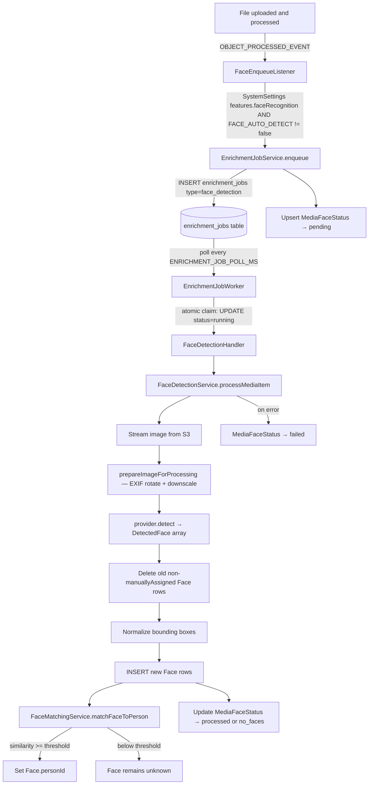

# Face Detection and Recognition — End-to-End Reference

| Field | Value |
|-------|-------|
| **Version** | 3.6 |
| **Last Updated** | July 2026 |
| **Status** | All phases implemented |

---

## Table of Contents

1. [Overview and Product Goal](#1-overview-and-product-goal)
2. [Architecture at a Glance](#2-architecture-at-a-glance)
3. [Providers and Abstraction](#3-providers-and-abstraction)
4. [Settings and Credentials](#4-settings-and-credentials)
5. [Detection Pipeline Step by Step](#5-detection-pipeline-step-by-step)
6. [Video Face Detection](#6-video-face-detection)
7. [Recognition: Embeddings, Matching, and Clustering](#7-recognition-embeddings-matching-and-clustering)
8. [People, Labeling, and Merge](#8-people-labeling-and-merge) (includes Manual People Association, Hide, Purge, Individual Face Archive, and Auto-Archive on Match)
9. [Image Quality and Resolution](#9-image-quality-and-resolution)
10. [EXIF Orientation](#10-exif-orientation)
11. [Global Feature Toggle and Biometric Privacy](#11-global-feature-toggle-and-biometric-privacy)
12. [Data Model](#12-data-model)
13. [API Endpoints](#13-api-endpoints)
14. [Configuration and Environment Variables](#14-configuration-and-environment-variables)
15. [Operations](#15-operations)
16. [Gotchas and Known Issues](#16-gotchas-and-known-issues)
17. [Infrastructure](#17-infrastructure)

---

## 1. Overview and Product Goal

Face detection and recognition enables users to organize their photo library by the people in it. A user can ask "find all photos of Lucia" or confirm that every family member appears in a given photo. The feature delivers this through a background enrichment pipeline with pluggable provider support and a global on/off toggle.

**Core capabilities:**

- Detect faces in photos automatically on upload when enabled globally (system setting `features.faceRecognition`, default off). Previously a per-circle opt-in; as of migration `20260621050000_drop_circle_feature_flags` this is a global toggle. **Note:** this migration dropped the per-circle `face_recognition_enabled` column — any previously-enabled circles lost that setting and an Admin must re-enable the feature globally.
- Generate embedding vectors that encode each face's identity.
- Recognize the same person across many photos by comparing embeddings.
- Allow users to label people by name.
- Cluster unknown faces into provisional person groups.
- Merge two clusters when a model incorrectly splits one person into two.
- Re-run detection on demand for any photo.
- Backfill an entire circle's existing photos.
- Erase all biometric data for a circle in a single irreversible operation.

Face enrichment is deliberately decoupled from the synchronous upload path. Uploads must complete quickly; face detection against an external sidecar or cloud API can take seconds per photo and must be re-runnable and backfillable. The generic `enrichment_jobs` table and its worker manage this asynchronous execution. See **[docs/specs/enrichment-queue.md](enrichment-queue.md)** for the full queue architecture.

---

## 2. Architecture at a Glance



The synchronous base enrichment chain (EXIF extraction, dimensions, geolocation) completes first and emits `OBJECT_PROCESSED_EVENT`. `FaceEnqueueListener` receives this event and inserts a job into the generic queue. From that point the flow is entirely asynchronous.

See **[docs/specs/enrichment-queue.md](enrichment-queue.md)** for the worker lifecycle, retry logic, priority ordering, and how to add new enrichment handlers.

---

## 3. Providers and Abstraction

### FaceProvider Interface

All providers implement the `FaceProvider` interface defined in `apps/api/src/face/providers/face-provider.interface.ts`.

**Properties:**

| Property | Type | Description |
|----------|------|-------------|
| `key` | `string` | Registry identifier (e.g. `'compreface'`) |
| `capabilities` | `FaceCapabilities` | What this provider can do |
| `modelVersion` | `string` | Human-readable model descriptor |
| `requiresCredentials` | `boolean` | Whether an API key is required |

**FaceCapabilities:**

```typescript
interface FaceCapabilities {
  detect: boolean;            // Can detect face bounding boxes
  embed: boolean;             // Can generate embedding vectors
  delegatedRecognize: boolean; // Uses external collection for matching (Rekognition)
}
```

**DetectedFace:**

```typescript
interface DetectedFace {
  boundingBox: { x: number; y: number; w: number; h: number };
  confidence?: number;
  landmarks?: unknown;
  embedding?: number[];
  externalFaceId?: string;
}
```

**Methods:**

| Method | Required | Description |
|--------|----------|-------------|
| `detect(creds, imageBuffer)` | Yes | Returns array of DetectedFace |
| `embed(creds, imageBuffer)` | No | Returns embedding for first face |
| `enroll(creds, imageBuffer, faceId)` | No | Adds face to external collection |
| `recognize(creds, imageBuffer, circleId)` | No | Searches external collection |
| `listModels(creds)` | No | Returns available models |
| `testConnection(creds)` | No | Validates connectivity |

### Provider Comparison

| Property | `human` | `compreface` | `rekognition` |
|----------|---------|--------------|---------------|
| `key` | `human` | `compreface` | `rekognition` |
| `modelVersion` | `human-faceres-1024` | `compreface-arcface-mobilefacenet-128` | `rekognition-2023` |
| Embedding dimensions | 1024 | 128 | None (delegated) |
| `requiresCredentials` | `false` | `false` | `true` |
| `detect` | Yes | Yes | Yes |
| `embed` | Yes | Yes | No |
| `delegatedRecognize` | No | No | Yes |
| Infrastructure | In-process WASM | `compreface-core` sidecar | AWS cloud API |
| Data leaves server | No | No | Yes |
| Cost | Free | Free | Per-image (AWS pricing) |
| When to use | Privacy-first, no containers | Recommended default, balanced accuracy | Highest accuracy, cloud, cost |

**Recommended default:** `compreface`. It requires no API key, runs as a stateless sidecar on the same Docker network, produces 128-d ArcFace MobileFaceNet embeddings stored in the application's own database, and keeps all photo data and biometric vectors on-premise.

### Provider Registry

`apps/api/src/face/providers/face-provider.registry.ts` maintains a simple Map:

```typescript
new Map([
  ['compreface', new ComprefaceProvider()],
  ['rekognition', new RekognitionProvider()],
  ['human', new HumanProvider()],
])
```

**To add a new provider:**

1. Implement the `FaceProvider` interface under `apps/api/src/face/providers/`.
2. Add one entry to the registry Map: `['your-key', new YourProvider()]`.

No further wiring is required. The provider will appear in the admin UI and settings endpoints automatically.

---

## 4. Settings and Credentials

### Admin-Only Access

All face settings endpoints require the Admin system role. Two permissions gate access:

- `face_settings:read` — view configuration, test connectivity, list models.
- `face_settings:write` — configure credentials, set active detection provider, run backfill, erase biometrics.

### Credential Encryption

API keys are encrypted with AES-256-GCM using `SECRETS_ENCRYPTION_KEY` (a base64-encoded 32-byte key). The plaintext key is never stored or returned from any endpoint. Only the `last4` characters are exposed for display purposes. The API fails to start if `SECRETS_ENCRYPTION_KEY` is absent or incorrectly sized.

Generate a key: `openssl rand -base64 32`

### Keyless Providers

`human` and `compreface` have `requiresCredentials: false`. No API key is needed. A credential row for these providers, if present, stores only an optional `baseUrl` override — useful when the CompreFace sidecar runs at a non-default address. No key is set or required.

### Active Detection Feature

The active provider and model are persisted in the `system_settings` table under the key `'global'`, at JSON path `.face.features.detection.{ provider, model }`. This record is created automatically when `PUT /api/face/features/detection` is first called. The `system_settings` row for key `'global'` must exist before this path can be written.

### Endpoints

| Method | Path | Permission | Description |
|--------|------|------------|-------------|
| `GET` | `/api/face/settings` | `face_settings:read` | Get all providers, known providers (credential-required, unconfigured), capabilities, and active detection feature |
| `PUT` | `/api/face/credentials/:provider` | `face_settings:write` | Upsert provider credentials encrypted at rest |
| `DELETE` | `/api/face/credentials/:provider` | `face_settings:write` | Remove provider credentials |
| `POST` | `/api/face/test` | `face_settings:read` | Test provider connectivity |
| `GET` | `/api/face/models` | `face_settings:read` | List available models for a provider |
| `PUT` | `/api/face/features/detection` | `face_settings:write` | Set active face-detection provider and model |

---

## 5. Detection Pipeline Step by Step

### Triggers

| Trigger | How | Priority |
|---------|-----|----------|
| Upload (automatic) | `FaceEnqueueListener` on `OBJECT_PROCESSED_EVENT` | 10 |
| Per-photo rerun (user) | `POST /api/media/:id/faces/rerun` | 0 (highest) |
| Backfill (admin) | `POST /api/admin/face/backfill { force? }` | 100 (lowest) |

The listener only enqueues when `MediaType` is `photo` (not video), `mediaItem.deletedAt` is null, `FACE_AUTO_DETECT` is not `'false'`, and `features.faceRecognition` is `true` in system settings.

Backfill skips items already in `processed` or `no_faces` status unless `force: true` is passed.

For queue mechanics (worker polling, atomic claim, retry, concurrency), see **[docs/specs/enrichment-queue.md](enrichment-queue.md)**.

### processMediaItem — 12 Steps

`FaceDetectionService.processMediaItem` in `apps/api/src/face/face-detection.service.ts`:

**Step 1.** Upsert `MediaFaceStatus` to `processing`.

**Step 2.** Read active provider key and model from `system_settings['global'].face.features.detection`.

**Step 3.** Call `FaceSettingsService.resolveCredentials(providerKey)`. For keyless providers, returns optional `baseUrl` override from the credential row if one exists. For credential-required providers, the credential row must exist and be enabled; otherwise throws.

**Step 4.** Load `MediaItem` including the associated `storageObject.storageKey`.

**Step 5.** Stream the S3 object into a buffer.

**Step 5.5.** Call `prepareImageForProcessing(buffer, { maxDim: parseInt(FACE_MAX_IMAGE_DIM ?? '2000') })`. This applies EXIF rotation via `sharp().rotate()`, optionally downscales to `maxDim` on the longest side, and returns `{ buffer (upright JPEG), width, height }`. If `sharp` fails, falls back to the raw buffer with `width=0, height=0` and logs a warning. Processing continues with the raw buffer.

**Step 6.** Call `provider.detect(credentials, uprightBuffer)` and receive `DetectedFace[]`.

**Step 7.** Delete all existing `Face` rows for this `mediaItemId` where `manuallyAssigned=false`. This makes reruns idempotent without disturbing faces the user has manually assigned.

**Step 8.** Normalize bounding boxes. If any of `x`, `y`, `w`, or `h` in the returned bounding box is greater than 1.0, the box is in absolute pixel coordinates — divide by `uprightWidth` and `uprightHeight` to get fractions in 0–1. If all values are already ≤ 1.0, use them as-is. Note: the CompreFace provider returns absolute pixel coordinates from the sidecar; the Human provider returns normalized fractions directly. Normalization is always applied in the service, not the provider.

**Step 9.** L2-normalize embeddings (belt-and-suspenders pass; providers already normalize internally).

**Step 10.** Create `Face` rows one by one in a loop to obtain their generated IDs for the matching step.

**Step 11.** Attempt matching for each face:
- If the provider uses `delegatedRecognize` and the face has an `externalFaceId`: call `FaceMatchingService.matchFaceByExternalId(circleId, externalFaceId)`.
- Else if the face has an embedding: call `FaceMatchingService.matchFaceToPerson(circleId, embedding)`.
- If a match is found: update `Face.personId`.

**Step 12.** Upsert `MediaFaceStatus` to `processed` if at least one face was detected, or `no_faces` if the detected array was empty.

**On error at any step:** call `markFailed()` which upserts `MediaFaceStatus.status = failed` and stores the error message in `lastError`.

---

## 6. Video Face Detection

### Overview

`VideoFaceDetectionHandler` (`apps/api/src/face/video-face-detection.handler.ts`) implements the `video_face_detection` enrichment job type. It extracts JPEG frames from a video using ffmpeg, runs the active face provider on each frame using shared `FaceDetectionCore` logic, deduplicates faces across frames by embedding similarity, and writes one `Face` row per identity cluster per video.

Shared logic (`FaceDetectionCore`, `apps/api/src/face/face-detection-core.service.ts`) is used by both the photo `face_detection` handler and this video handler for provider resolution, per-frame detection, bounding box normalization, L2 embedding normalization, face persistence, and person matching.

Frame extraction is implemented in `VideoFrameExtractionService` (`apps/api/src/face/video-frame-extraction.service.ts`), which uses `fluent-ffmpeg` to seek to each computed timestamp and output a single JPEG frame per seek.

### Enqueue Routing

`MediaEnrichmentService.enqueueUploadEnrichment` decides the job type based on `MediaType`:

| Media type | Feature gate | Env kill-switch | Job type enqueued | Priority |
|------------|-------------|-----------------|-------------------|----------|
| `photo` | `features.faceRecognition=true` | `FACE_AUTO_DETECT != 'false'` | `face_detection` | 10 |
| `video` | `features.faceRecognition=true` AND `face.video.enabled=true` | `FACE_AUTO_DETECT != 'false'` | `video_face_detection` | 20 |

Video jobs are assigned priority 20 so that photo `face_detection` jobs (priority 10) drain first and a long video cannot head-of-line-block them.

Admin backfill (`POST /api/admin/face/backfill`) includes both photos and videos, enqueuing the correct type (`face_detection` or `video_face_detection`) per item.

Per-item rerun (`POST /api/media/:id/faces/rerun`) also routes by media type, enqueuing `video_face_detection` at priority 0 for video items.

### Frame Sampling Algorithm

`VideoFrameExtractionService` computes seek timestamps without reading the video's actual frame rate:

```
durationSec = mediaItem.durationMs / 1000
interval    = max(sampleIntervalSeconds, durationSec / maxFramesPerVideo)
timestamps  = [interval/2, interval*1.5, interval*2.5, …]   (mid-interval; capped at maxFramesPerVideo)
```

Mid-interval sampling (starting at `interval/2` rather than `0`) avoids extracting identical frames at hard scene boundaries.

**Example — 1-hour video with defaults (sampleIntervalSeconds=5, maxFramesPerVideo=60):**

```
durationSec = 3600
interval    = max(5, 3600/60) = max(5, 60) = 60 s
timestamps  = [30 s, 90 s, 150 s, …, 3570 s]   → 60 frames
```

**Example — 30-second clip with defaults:**

```
durationSec = 30
interval    = max(5, 30/60) = max(5, 0.5) = 5 s
timestamps  = [2.5 s, 7.5 s, 12.5 s, 17.5 s, 22.5 s, 27.5 s]   → 6 frames
```

When `durationMs` is 0 or absent, a single poster frame at 0 s is extracted.

Per-frame extraction errors are logged and skipped rather than aborting the job, so one corrupted seek still yields frames from other timestamps.

### Cross-Frame Deduplication

After detection, faces across all frames are clustered by identity to produce one `Face` row per person per video rather than one row per occurrence per frame.

**Algorithm — greedy single-pass:**

For each frame detection (in order):
1. Compare its L2-normalized embedding to every existing cluster's representative via cosine similarity.
2. If the best similarity is ≥ `FACE_CLUSTER_THRESHOLD` (default `0.45`), assign the detection to that cluster. Update the representative if the new detection has higher confidence (tie-break: larger bounding-box area).
3. Otherwise, start a new cluster.

Detections with empty embeddings (rare edge case) become singleton clusters.

**Rekognition (delegated path):** Rekognition does not return per-face embeddings — recognition is delegated to AWS collections. Cross-frame clustering is skipped; every detection becomes its own cluster. Each `Face` row still records `videoTimestampMs`.

### Frame Thumbnail Storage

For each cluster's representative frame, the handler:
1. Downscales the representative frame JPEG to at most 800 px on the longest side (matching the thumbnail processor).
2. Uploads it to the active storage provider under `video-faces/{mediaItemId}/{uuid}.jpg`.
3. Stores the resulting key in `Face.frameThumbnailKey`.

`GET /api/media/:id/faces` signs `frameThumbnailKey` via `MediaThumbnailService.signThumb` and returns it as `faceThumbnailUrl`.

Thumbnail upload failure is non-fatal: the `Face` row is created without `frameThumbnailKey`, and `faceThumbnailUrl` is `null` in the API response.

### Settings

The following settings are read from `system_settings['global'].face.video` and are editable in Admin Settings → Face (`/admin/settings/face`). All require `features.faceRecognition=true` to have any effect.

| Setting | Type | Default | Description |
|---------|------|---------|-------------|
| `face.video.enabled` | Boolean | `true` | When `false`, video uploads set `MediaFaceStatus` to `no_faces` immediately without processing |
| `face.video.sampleIntervalSeconds` | Integer (1–60) | `5` | Desired gap between sampled frames in seconds; expands automatically when the video is long enough that `durationSec / maxFramesPerVideo` exceeds this value |
| `face.video.maxFramesPerVideo` | Integer (1–300) | `60` | Hard cap on frames extracted per video; bounds compute per video independent of duration |

### Known Limitation: Frame Thumbnail Signing on Multi-Provider Setups

Frame thumbnail JPEGs are uploaded to the active storage provider but are **not** registered as `StorageObject` rows. `signThumb` falls back to the default/static provider when signing them.

On a single-provider deployment (the typical VPS case where active == default), this is correct. On a multi-provider setup where the active provider for uploads differs from the env-default signing provider, the signed URL will target the wrong provider and the thumbnail will 404.

This is a known v1 limitation. A future improvement would register frame thumbnails as lightweight `StorageObject` rows so per-object provider routing applies.

---

## 7. Recognition: Embeddings, Matching, and Clustering

### Embeddings

All embedding vectors are L2-normalized to unit length before storage. Normalization is applied in the provider and again in the detection service. For L2-normalized unit vectors, cosine similarity reduces to the dot product: `similarity = A · B`.

Embedding dimensions are provider-specific and not cross-compatible:

| Provider | Dimensions | Algorithm |
|----------|-----------|-----------|
| `compreface` | 128 | ArcFace MobileFaceNet |
| `human` | 1024 | FaceRes (WASM) |
| `rekognition` | None stored | Delegated to AWS collection |

Never compare embeddings from different providers or different model versions. Switching providers requires re-processing all photos from the original S3 blobs.

### Per-Person Centroids

Matching uses a centroid computed per `Person`:

1. Load all `Face.embedding` values for the person.
2. Compute the element-wise sum.
3. Divide by the count to get the mean vector.
4. L2-normalize the mean to get the centroid.

Centroids are computed on demand inside `FaceMatchingService.computePersonCentroid(personId)`. They are recomputed after face assignment or merge operations.

### Face-to-Person Matching

`FaceMatchingService.matchFaceToPerson(circleId, embedding)`:

1. Load all active `Person` records for the circle (where `deletedAt=null` and `mergedIntoId=null`).
2. For each person, compute the centroid.
3. Compute cosine similarity between the candidate embedding and each centroid (dot product of unit vectors).
4. Find the person with the highest similarity.
5. If that similarity is ≥ `FACE_MATCH_THRESHOLD` (default `0.38`): return that person.
6. Otherwise: return `null` (face remains unassigned).

`FACE_VECTOR_BACKEND=pgvector` is now the default backend; see [Face Matching Backend: pgvector KNN](#face-matching-backend-pgvector-knn) below for the indexed KNN candidate-selection path that replaces steps 1–3 above. The accept/reject decision (steps 4–6) is unchanged — pgvector only accelerates which persons are worth scoring, never the final match decision.

### Delegated Matching (Rekognition)

When the active provider is `rekognition`, embeddings are not stored in the application database. Instead:

- `provider.detect()` calls `DetectFacesCommand` for bounding boxes.
- `provider.enroll()` calls `IndexFacesCommand` and returns an AWS FaceId stored as `Face.externalFaceId`.
- `FaceMatchingService.matchFaceByExternalId(circleId, externalFaceId)` finds an existing `Face` row in the circle sharing that `externalFaceId` and returns the associated `Person`.

### Face Matching Backend: pgvector KNN

**Why:** the original in-app path was an O(N) full scan — load every active `Person`'s centroid (or every archived face) into the process and cosine-score in JS. On the production API this pinned a Prisma connection and a CPU core per lookup and caused brownouts under load: `face_detection` job lifetime was ~14s normally but climbed to ~90s under bulk-upload load, because per-face matching serialized behind the scan. `FACE_VECTOR_BACKEND=pgvector` (default `DEFAULT_FACE_VECTOR_BACKEND = 'pgvector'`) delegates candidate selection to a Postgres HNSW index instead of scanning in the application process.

**The derived column.** `faces.embedding_vec` is a `vector(128)` column added by migration `20260715000000_add_face_embedding_vector`. **It is a derived column, automatically maintained by a database trigger, and application code — including Prisma — must never write it directly.** The trigger function `faces_sync_embedding_vec()` sets `NEW.embedding_vec := face_embedding_to_vector(NEW.embedding)`, where the SQL helper `face_embedding_to_vector(embedding float8[])` casts a 128-d float8 array to `vector` (via a `'[1,2,3]'::vector` text-literal cast) and returns `NULL` for any other length. Two triggers share that function, split because a trigger `WHEN` clause cannot reference `TG_OP`:
- `faces_sync_embedding_vec_insert_trigger` — `BEFORE INSERT`, unconditional.
- `faces_sync_embedding_vec_update_trigger` — `BEFORE UPDATE`, `WHEN (NEW.embedding IS DISTINCT FROM OLD.embedding)`, so the frequent person-assignment / hide-unhide updates that never touch `embedding` skip the recompute.

`embedding_vec` is `NULL` for the `human` provider's 1024-d embeddings and for empty-array rows (e.g. manual `providerKey='manual'` associations). A one-shot backfill (`UPDATE faces SET embedding_vec = face_embedding_to_vector(embedding) WHERE array_length(embedding,1)=128`) populated existing rows before the indexes were built — index-after-backfill is deliberate, giving one clean index build instead of many incremental ones.

**The three HNSW indexes** (cosine ops, `m=16, ef_construction=64`, matching the other HNSW indexes in the codebase):
- `faces_embedding_vec_hnsw_idx` — full-table index.
- `faces_embedding_vec_archive_hnsw_idx` — **partial** index, `WHERE person_id IS NULL AND hidden_at IS NOT NULL`, serves the selective archived/hidden-face KNN queries (smaller and faster than scanning the full-table index for that access pattern).
- `faces_embedding_vec_assigned_hnsw_idx` — **partial** index, `WHERE person_id IS NOT NULL AND embedding_vec IS NOT NULL`, serves person-matching KNN (added by migration `20260718000000_add_face_assigned_embedding_index`, issue #133). Right after a large import the `faces` table is dominated by unassigned faces (`person_id IS NULL`); a KNN walk over the full-table main index returned mostly unassigned rows that then had to be discarded by the query's `person_id IS NOT NULL` filter, starving the K-nearest candidate-person list. Restricting the index itself to assigned rows fixes that without any service-layer SQL change — the query's existing `WHERE person_id IS NOT NULL` predicate already matches the partial index's predicate, so Postgres picks it automatically.

**Person-match algorithm** (`FaceMatchingService.matchFaceToPerson` → private `matchFaceToPersonPgvector` when the probe is 128-d and the backend is `pgvector`): a KNN query against `faces_embedding_vec_assigned_hnsw_idx` — the assigned-set partial index, not the full-table main index, precisely to avoid the unassigned-face starvation problem above — (joined to `people`, filtering `deleted_at IS NULL AND merged_into_id IS NULL`) returns the `FACE_MATCH_KNN_CANDIDATES` (default `40`) nearest candidate faces; their distinct person ids, nearest-first, become the candidate set. For each candidate person, the code recomputes the unchanged float8 centroid via `computePersonCentroid()` and applies the exact same `cosineSimilarity()` vs. `FACE_MATCH_THRESHOLD` (`0.38`) accept/reject decision as the in-app path. This is deliberate parity: pgvector KNN only narrows which persons are worth scoring — it never decides a match on its own — so results are numerically identical to the in-app path for whichever persons make the K cut. `hnsw.ef_search` is raised via `SET LOCAL hnsw.ef_search = <n>` to `max(100, FACE_MATCH_KNN_CANDIDATES)` inside the same transaction as the KNN `SELECT` (issued together via `$transaction([...])`, since `SET LOCAL` is transaction-scoped) to protect recall against pgvector's low default `ef_search`.

**Archive-match algorithm** (`matchFaceToArchived` → private `matchFaceToArchivedPgvector`): KNN against the partial archive index, single nearest archived face accepted if its cosine similarity meets `FACE_ARCHIVE_MATCH_THRESHOLD` (`0.45`). When the caller supplies a pre-loaded reference set (`opts.candidates` — the in-loop reuse case where `face-detection-core` probes many faces against one already-loaded archived set), the method **always** uses the in-app path regardless of `FACE_VECTOR_BACKEND`, since a per-probe KNN round-trip would be strictly worse there.

**Dimension guard.** The pgvector path is taken only when the probe embedding is exactly 128-d (`PGVECTOR_EMBEDDING_DIM = 128`, the `compreface` mobilenet provider's dimensionality). A 1024-d `human`-provider probe, or an empty embedding, falls back to the in-app cosine path automatically — a `vector(128)` cast would otherwise raise a dimensionality error. This guard becomes moot once the sibling `human`-provider removal (issue #113) lands, since only 128-d embeddings will exist at that point.

**Correctness note.** HNSW is an *approximate* nearest-neighbor index — a borderline match could in principle be missed if it falls just outside the K-nearest candidates returned. This is a soft, recoverable failure mode: worst case, a face that should match a person stays unassigned and gets another chance on a future detection or rerun. It is mitigated by the `ef_search` floor and a generous default K (`40`).

**Scope note — `findLiveMatchesAgainstArchived`.** Used by the face-auto-archive backfill/sweep (`face_auto_archive_sweep`), not the hot per-upload path — it deliberately stays on the in-app cosine path even under `FACE_VECTOR_BACKEND=pgvector`. Its archived reference set is already bounded and loaded once; a pgvector rewrite would trade a bounded, non-latency-critical sweep for either N per-live-face KNN round-trips or a long-held interactive transaction. The hot single-probe paths above are where the index pays off; this bulk sweep path is not rewritten.

**Rollback.** `FACE_VECTOR_BACKEND=app` restores the pre-issue-112 in-app cosine path — the one-release rollback option if the pgvector path misbehaves in production.

**Doctor check.** `face.pgvector` (label "Face pgvector index") lives in the Face section alongside `face.detection` and `face.flagConsistency`. It is `skipped` when the backend is `app` ("FACE_VECTOR_BACKEND=app; face matching uses in-app cosine (pgvector column not required)."); otherwise it checks `information_schema.columns` for `embedding_vec` and `pg_indexes` for all three HNSW index names — `warning` if the column or the main index (`faces_embedding_vec_hnsw_idx`) is missing (actionItem: run `npx prisma migrate deploy`, or set `FACE_VECTOR_BACKEND=app` to roll back); a separate `warning` if only the partial archive index (`faces_embedding_vec_archive_hnsw_idx`) is missing (face-auto-archive KNN falls back to the main index and is slower; actionItem: run migrations); a further separate `warning` if only the partial assigned-set index (`faces_embedding_vec_assigned_hnsw_idx`) is missing ("faces_embedding_vec_assigned_hnsw_idx (partial assigned-set index) is missing; person-match KNN falls back to the main index and can be starved by unassigned faces after bulk imports."; actionItem: run migrations to add the partial assigned-set index); `ok` ("faces.embedding_vec column and all three HNSW indexes present.") when the column and all three indexes are present; `error` on any exception querying the catalog.

### Clustering Unknown Faces

`POST /api/people/cluster { circleId }` triggers `FaceClusteringService` (requires `circle_admin` role and `features.faceRecognition=true` in system settings).

**Algorithm: greedy union-find**

1. Load all `Face` rows in the circle where `personId=null` and `embedding` is non-empty.
2. Compute cosine similarity for every pair — O(n²) operation.
3. For any pair with similarity ≥ `FACE_CLUSTER_THRESHOLD` (default `0.45`), union their sets using path-compressed union-find.
4. Group faces by root of their union-find set.
5. For each group with size ≥ `FACE_CLUSTER_MIN_SIZE` (default `2`), create a new `Person` with `name=null` (unlabeled) and assign the faces with `manuallyAssigned=false`.
6. Singletons below `FACE_CLUSTER_MIN_SIZE` remain with `personId=null`.

The cluster threshold (`0.45`) is intentionally stricter than the match threshold (`0.38`) to avoid false groupings during initial clustering. Individual photo matching uses a more lenient threshold once a person's centroid is established.

---

## 8. People, Labeling, and Merge

### Person Model

| Field | Type | Description |
|-------|------|-------------|
| `id` | UUID | Primary key |
| `circleId` | UUID | Scoped to one circle |
| `name` | String? | Display name; null until labeled by a user |
| `addedById` | UUID | User who created this record |
| `coverFaceId` | UUID? | FK to `faces` — used as the profile thumbnail |
| `mergedIntoId` | UUID? | Self-FK — audit breadcrumb when two clusters are merged; never resolves further |
| `deletedAt` | DateTime? | Soft-delete timestamp |

Active persons are those with `deletedAt=null` and `mergedIntoId=null`.

### Labeling Workflow

Users label people from the People page (`/people`). The page shows:
- A grid of named persons.
- An Unknown Faces review section listing faces with `personId=null`.
- `GET /api/people?circleId=&includeUnlabeled=&page=&pageSize=` — filtered person list.
- `PATCH /api/people/:id { name?, coverFaceId? }` — rename or set cover face.
- `POST /api/people/:id/faces { faceIds[] }` — manually assign faces; sets `manuallyAssigned=true`.

Manually assigned faces (`manuallyAssigned=true`) are not overwritten by subsequent auto-detection reruns or clustering.

### Unassigned Faces

`GET /api/people/unassigned?circleId=&page=&pageSize=&archived=` returns faces where `personId=null` and the associated `mediaItem.deletedAt=null`. The `archived` boolean param (added alongside individual-face archive support, see [Individual Face Archive and Purge](#individual-face-archive-and-purge-unassigned-faces) below) defaults to excluding archived faces; pass `archived=true` to list only archived ones. Response items include `hiddenAt`.

### Merge

`POST /api/people/merge { sourceId, targetId }` (requires `collaborator` role):

Inside a single database transaction:
1. Reassign all `Face.personId` from `source` to `target`.
2. If `target` has no `coverFaceId` and `source` does, carry `source.coverFaceId` to `target`.
3. Set `source.mergedIntoId = targetId` (audit breadcrumb for history).
4. Soft-delete `source` with `deletedAt = now()`.
5. Update `target` metadata.
6. Recompute the target person centroid.
7. Emit audit event `person:merge`.

The eager face reassignment means a query `WHERE personId = targetId` always returns the complete merged set without chain resolution.

### Delete Person

`DELETE /api/people/:id` (requires `collaborator` role):

Inside a transaction:
1. Set `personId=null` and `manuallyAssigned=false` on all faces belonging to this person.
2. Soft-delete the person with `deletedAt = now()`.
3. Emit audit event `person:delete`.

Face rows and their embeddings are retained. The faces re-enter the unknown pool and can be reassigned or reclustered.

### Manual People Association

When face detection misses a face — or when a user wants to tag a person who is partially obscured — collaborators can associate a person with a photo from the media properties pane without a bounding box.

**How it works:**

Manual associations are stored as regular `Face` rows with the following sentinel values:

| Field | Value |
|-------|-------|
| `providerKey` | `'manual'` |
| `manuallyAssigned` | `true` |
| `embedding` | `[]` (empty) |
| `boundingBox` | `{ x: 0, y: 0, w: 0, h: 0 }` |
| `confidence` | `null` |

Using the existing `Face` model means all downstream features work unchanged: `GET /api/people?circleId=` counts the photo against the person, the person gallery includes the photo, `GET /api/media?personId=` returns the photo, and the `noFaces` filter correctly excludes it from the "no faces" work list.

**Idempotency:** Calling `POST /api/media/:id/people` with a `personId` that already appears on the item (whether via detection or a prior manual call) returns the existing association without creating a duplicate row.

**Find-or-create by name:** When `{ name }` is provided instead of `{ personId }`, the endpoint looks up an active `Person` with that name in the item's circle. If none exists, it creates one (equivalent to `POST /api/people { circleId, name }`). This allows tagging in a single request without a separate person-creation step.

**Preserved across reruns:** Face-detection reruns delete only rows where `manuallyAssigned=false`. Manual rows are left intact. If the provider subsequently detects the same person's face in the photo, both a detected face row and the manual face row may coexist; the person will appear in the gallery through either row.

**Auto-tagging re-enqueue:** Adding or removing a manual association re-enqueues an `auto_tagging` enrichment job for the media item (priority 0). This ensures the vision model's description and embedding reflect the updated person context.

**Endpoints:**

| Method | Path | Permission | Per-circle Role | Description |
|--------|------|------------|-----------------|-------------|
| `POST` | `/api/media/:id/people` | `media:write` | collaborator | Associate a person; body `{ personId }` or `{ name }` (exactly one); idempotent; returns `{ personId, personName, faceId, mediaItemId }` |
| `DELETE` | `/api/media/:id/people/:personId` | `media:write` | collaborator | Remove the manual association; 404 if no manual face for that person; 204 No Content |

### Hide and Purge

Two independent actions let users manage unwanted people or clusters without affecting photo visibility.

#### Hide (reversible)

`PATCH /api/people/bulk/hide` body `{ circleId, ids[] }` (1–500, `collaborator` role):

Sets `Person.hiddenAt = now()` on each named person or unnamed cluster in the list. Hidden persons:

- Are excluded from the People page grid and the Unknown Faces review queue.
- Are **not** deleted. Their `Face` rows and embeddings are preserved; new detections can still match to them.
- Their media items remain fully visible in browse, albums, search, and all `?personId=` filters — hide is a UI-surface filter only, not a data erasure.
- Are retrievable via `GET /api/people?circleId=...&hidden=true` (returns only hidden persons; response items include `hiddenAt`). The default list — `GET /api/people?circleId=...` — excludes hidden persons.

`PATCH /api/people/bulk/unhide` body `{ circleId, ids[] }` (1–500, `collaborator` role) clears `hiddenAt`, restoring the person to the normal People UI surfaces.

`hiddenAt` is independent of `deletedAt`. A person can be hidden without being deleted; the two states do not interact.

#### Purge (permanent)

`POST /api/people/bulk/purge` body `{ circleId, ids[] }` (1–500, `media:delete` + `collaborator` role):

Hard-deletes the Person row and all of its associated `Face` rows in a single transaction. This reclaims embedding storage and permanently removes biometric associations. After purge:

- The person no longer appears in any query.
- Faces that were assigned to the person are gone; the affected media items have no face rows for that individual.
- An `auto_tagging` enrichment job is re-enqueued at priority 0 for each affected media item so descriptions and embeddings refresh without the purged person's context.
- An audit event `person:purge` is written with the acting user, target person ID, and affected media item count.

**Photos and media items are never deleted by purge.** Only the `Person` record and its `Face` rows are removed.

#### Comparison

| Action | `hiddenAt` | `Face` rows | Media visible | Reversible | Permission |
|--------|-----------|-------------|---------------|------------|------------|
| Hide | set | preserved | yes | yes (unhide) | `media:write` + collaborator |
| Soft-delete | — | freed to unknown pool | yes | no (currently) | `media:write` + collaborator |
| Purge | — | hard-deleted | yes | no | `media:delete` + collaborator |

#### Audit Events

| Event | Trigger |
|-------|---------|
| `person:hide` | `PATCH /api/people/bulk/hide` |
| `person:unhide` | `PATCH /api/people/bulk/unhide` |
| `person:purge` | `POST /api/people/bulk/purge` |

#### Frontend Integration

The People page (`/people`) gains two tabs:

- **People** — existing named persons and clusters (hidden persons excluded).
- **Hidden** — persons with `hiddenAt IS NOT NULL`; shows a count badge. Each card has an unhide action and a permanent-delete confirm dialog that calls `POST /api/people/bulk/purge`.

In the default People tab, each named person card and each unknown cluster card shows a hide action (eye-off icon). A selection-mode bulk toolbar exposes hide for multiple selected persons in one call.

### Individual Face Archive and Purge (Unassigned Faces)

The same hide/purge pattern used for `Person` records (above) is also available one level down, on individual **unassigned** faces (`personId=null`) inside the Unassigned Faces pool. This lets a user dismiss a stray detection — a stranger in the background, a false-positive crop, a pet's face a provider mistook for human — without waiting for it to be clustered or named first. Assigned faces (`personId` set) are not covered by these endpoints; they are managed through their `Person` via the hide/purge flow in [Hide and Purge](#hide-and-purge) above.

#### Archive (reversible)

`PATCH /api/people/faces/bulk/hide` body `{ circleId, ids[] }` (face ids, 1–500, `collaborator` role):

Sets `Face.hiddenAt = now()` on each listed face. The endpoint only operates on faces where `personId=null`; it does not touch assigned faces. Archived faces:

- Are excluded from `GET /api/people/unassigned?circleId=&...` by default (the endpoint's live/archived split works exactly like the person-level `hidden` split — see [Unassigned Faces](#unassigned-faces) above).
- Are **not** deleted. The `Face` row and its embedding are preserved.
- Are excluded from `POST /api/people/cluster` candidate selection, so an archived stray never gets re-surfaced into a new provisional `Person` on a subsequent clustering pass. This is the main reason archive exists as a distinct step before purge: it gives clustering a durable "not a real face" signal without destroying the row, in case the decision needs to be reversed.
- Do not affect any media item's visibility, tags, or search results — archiving a face is a People-surface filter only, exactly like person-level hide.

`PATCH /api/people/faces/bulk/unhide` body `{ circleId, ids[] }` (1–500, `collaborator` role) clears `hiddenAt`, returning the face to the live unassigned pool (and back into future clustering candidacy).

#### Purge (permanent)

`POST /api/people/faces/bulk/purge` body `{ circleId, ids[] }` (1–500, `media:delete` + `collaborator` role):

Hard-deletes the listed `Face` rows. Unlike person purge, there is no associated `Person` record to remove — these are unassigned faces. This reclaims the storage of the `embedding` column (128-d to 1024-d float arrays, depending on provider), which is the only sizable payload on a `Face` row. After purge:

- The face no longer appears in any query, including the archived sub-view.
- An `auto_tagging` enrichment job is re-enqueued for each affected media item, so descriptions and embeddings are recomputed without the deleted face's context (mirrors person purge).
- Photos and media items are never deleted or otherwise modified — only the `Face` row is removed.

**Archive-first UX:** the frontend does not expose permanent delete directly from the live Unassigned Faces list. A face must first be archived; permanent delete is only reachable from within the "Archived faces" sub-view, behind a confirm dialog. This mirrors the two-step person Hide → Hidden tab → purge flow and prevents accidental irreversible deletes from the primary review surface.

#### Comparison

| Action | `Face.hiddenAt` | Row | Excluded from clustering | Media visible | Reversible | Permission |
|--------|-----------------|-----|---------------------------|----------------|------------|------------|
| Archive | set | preserved | yes | yes | yes (unhide) | `media:write` + collaborator |
| Purge | — | hard-deleted | n/a (gone) | yes | no | `media:delete` + collaborator |

#### Endpoints

| Method | Path | Permission | Per-circle Role | Description |
|--------|------|------------|-----------------|-------------|
| `PATCH` | `/api/people/faces/bulk/hide` | `media:write` | collaborator | Archive 1–500 unassigned faces; sets `Face.hiddenAt`; body `{ circleId, ids[] }`; returns `{ hidden: number }` |
| `PATCH` | `/api/people/faces/bulk/unhide` | `media:write` | collaborator | Restore 1–500 archived unassigned faces; clears `Face.hiddenAt`; body `{ circleId, ids[] }`; returns `{ unhidden: number }` |
| `POST` | `/api/people/faces/bulk/purge` | `media:delete` | collaborator | Permanently hard-delete 1–500 unassigned `Face` rows; reclaims `embedding` storage; re-enqueues `auto_tagging` for affected media; body `{ circleId, ids[] }`; returns `{ deleted: number }` |
| `GET` | `/api/people/unassigned?archived=` | `media:read` | viewer | `archived=true` lists only archived faces; default excludes them |

### Auto-Archive on Match

A face a user has archived once (via the flow above) is usually not a one-off — a stray background stranger, a pet misdetected as human, or a false-positive crop tends to recur across many photos. Auto-archive closes that loop: once `features.faceAutoArchive` is enabled, any **newly-detected unassigned** face (no person match, non-empty embedding) that closely resembles an already-archived face is archived automatically, so it never lands in the Unassigned Faces review queue in the first place.

Disabled by default (`features.faceAutoArchive = false`). Enable at `/admin/settings/face`.

#### Two Thresholds, Two Purposes

Auto-archive introduces a third cosine-similarity threshold alongside the two already used by recognition and clustering:

| Threshold | Constant | Default | Compares | Purpose |
|-----------|----------|---------|----------|---------|
| Recognition | `FACE_MATCH_THRESHOLD` | `0.38` | face embedding → `Person` centroid (mean of many faces) | Assign a face to a known, already-labeled person |
| Clustering | `FACE_CLUSTER_THRESHOLD` | `0.45` | face embedding → face embedding (pairwise) | Group unlabeled faces into a provisional `Person` |
| Archive-match | `FACE_ARCHIVE_MATCH_THRESHOLD` | `0.45` | face embedding → face embedding (pairwise, vs. the archived pool) | Auto-hide a new detection that resembles something already dismissed |

Archive-match reuses the clustering value (`0.45`), not the looser recognition value (`0.38`), because it has the same geometry as clustering — face-to-face, not face-to-centroid — and because auto-archive is a **silent** action: the face disappears from the review queue with no per-item confirmation. A false positive here is a worse outcome than a false negative (a resemblant face staying in the queue one extra time costs nothing; wrongly hiding a face the user actually wanted to review is a quiet correctness bug). The stricter, cluster-grade threshold biases toward precision over recall. Both constants are defined once in `packages/enrichment-compute/src/face-video/index.ts` (`DEFAULT_FACE_CLUSTER_THRESHOLD`, `DEFAULT_FACE_ARCHIVE_MATCH_THRESHOLD`) and re-exported from `FaceMatchingService` so the shared parity package and the server-side threshold can never drift apart.

The runtime value is `face.autoArchive.matchThreshold` (system setting, 0.30–0.90, default `0.45`), seeded at env-var level by `FACE_ARCHIVE_MATCH_THRESHOLD`.

#### The Archived Reference Pool

"Archived" here means the same `Face.hiddenAt IS NOT NULL` state used by the manual per-face archive above — specifically the subset with `personId IS NULL` (unassigned). This pool is the reference set every incoming or existing face is compared against. It is loaded via `FaceMatchingService.matchFaceToArchived` (one embedding vs. the pool) and `FaceMatchingService.findLiveMatchesAgainstArchived` (the inverse: the whole live unassigned pool vs. the reference set), both in `apps/api/src/face/face-matching.service.ts`. The pool is capped at `FACE_ARCHIVE_MAX_CANDIDATES` (default `5000`) per circle, ordered most-recently-hidden first, so a truncated scan favors the freshest archive decisions. Both methods are read-only and accept a pre-loaded `candidates`/`archivedCandidates` array so callers that already queried the pool once per job don't pay for it twice.

**Memory bound:** holding the full candidate set in memory costs `candidates × embeddingDim × 8 bytes` (float64 JS numbers) — at the default cap of 5000 and the largest supported embedding (Human, 1024-d), that's `5000 × 1024 × 8 ≈ 41 MB` per job, comfortably inside a worker's heap even on a constrained VPS. Lower `FACE_ARCHIVE_MAX_CANDIDATES` on memory-constrained deployments with very large archived pools.

pgvector seam: like `matchFaceToPerson`, both methods currently fall through to in-app cosine regardless of `FACE_VECTOR_BACKEND`; a native `<=>` KNN query is a future optimization.

#### Three Trigger Paths

Auto-archive can hide a face through three independent code paths, all gated on the same `features.faceAutoArchive` system setting (checked fresh on every call, never cached) and the `FACE_AUTO_ARCHIVE` env kill-switch:

1. **Detection-time (new faces).** `FaceDetectionCore.persistAndMatchFaces` (`apps/api/src/face/face-detection-core.service.ts`, shared by both the photo `face_detection` handler and the video handler) reads the gate once per job. For each newly-created face that finds no person match and has a non-empty embedding, it lazily loads the archived reference pool (once per job, only if needed) and calls `matchFaceToArchived`. Matches are collected and batch-archived (`updateMany`) after the person-matching loop completes, rather than one `UPDATE` per face. A settings-read failure or matching error is logged and swallowed — it must never abort face detection itself.
2. **Archive-time retroactive sweep (existing live faces).** `PeopleService.hideFaces` (`PATCH /api/people/faces/bulk/hide`) performs the user's requested manual archive first, then — best-effort, never failing the request — takes the just-archived face(s) as a small reference set and calls `findLiveMatchesAgainstArchived` to sweep the *rest* of the live unassigned pool for anything that now resembles them. Matches are archived in the same call, and the response's `hidden` count is the combined total (manual + swept); the audit event records the swept count separately under `meta.autoHidden`. This is what makes archiving a face immediately clear out its look-alikes instead of waiting for them to be re-detected later.
3. **Admin backfill (whole existing backlog).** `POST /api/admin/face/auto-archive/backfill` enqueues one server-only `face_auto_archive_sweep` enrichment job per circle that already has at least one archived unassigned face (`FaceBackfillService.autoArchiveBackfillAllCircles`). Unlike paths 1–2, which only ever look forward from a specific event, the sweep job (`FaceAutoArchiveSweepHandler`, type `face_auto_archive_sweep`) walks the circle's *entire* live unassigned pool in cursor-paginated batches (500 per page — offset pagination is unsafe here because hiding matches removes rows from the `hiddenAt: null` set mid-sweep) against the archived reference set loaded once up front. Use this after enabling `features.faceAutoArchive` on a circle that already has both an archived backlog and an unassigned-faces backlog predating the toggle.

All three paths funnel through the same `FaceMatchingService` methods and write the same provenance (`hiddenAt` + `hiddenReason='auto_archive_match'`), so behavior is identical regardless of which path triggered the hide.

#### `hiddenReason` Provenance

`Face.hiddenReason` (String?, migration `20260712000000_add_face_hidden_reason`) distinguishes *why* a face was archived:

| Value | Meaning |
|-------|---------|
| `null` | Manual archive — the user explicitly selected this face and called `PATCH /api/people/faces/bulk/hide` |
| `'auto_archive_match'` | Any of the three trigger paths above archived this face because it matched the circle's archived reference pool |

The column is additive and nullable — no backfill was needed for faces archived before this feature existed; they simply read as `null` (manual), which is the correct historical interpretation since auto-archive did not exist yet. Nothing currently reads `hiddenReason` back out through the API (it is not yet surfaced in `GET /api/people/unassigned?archived=true`), but it gives operators and future UI work an audit trail to distinguish "the user chose to hide this" from "the system inferred this should be hidden," which matters for building trust in a feature that acts silently.

#### Server-Only and Node Parity

`face_auto_archive_sweep` implements only the in-process `process()` half of the `EnrichmentHandler` interface — it has no `nodeResultSchema` or `persistNodeResult`, and is deliberately absent from the CLI's `NODE_JOB_TYPES` list, so it is never claimable by a distributed worker node (mirrors the `thumbnail_repair` and `location_inference`-sweep precedent — see the [Distributed Nodes spec](distributed-nodes.md)). This only affects the **backfill sweep job**, which always runs on the server.

The per-upload and per-archive trigger paths (1 and 2 above) are unaffected by node deployments: both run inside server-side code (`FaceDetectionCore.persistAndMatchFaces` and `PeopleService.hideFaces`), and for the node-detection path specifically, `persistAndMatchFaces` is invoked during **node-result ingestion** (`persistNodeResult`, on the API server, after a node submits its computed face-detection result) — not on the node itself. So a node never needs the archived-face embedding pool and never sees biometric reference data; auto-archive matching always happens server-side, and the feature works identically whether detection ran in-process or on a distributed node.

#### Settings and Environment Variables

| Key | Type | Default | Description |
|-----|------|---------|--------------|
| `features.faceAutoArchive` | System setting (boolean) | `false` | Global on/off for the entire feature (all three trigger paths) |
| `face.autoArchive.matchThreshold` | System setting (number, 0.30–0.90) | `0.45` | Cosine-similarity threshold for an archive match; shared by all three trigger paths |
| `FACE_AUTO_ARCHIVE` | Env var | `true` | Kill-switch; `false` disables the feature regardless of the system setting (CI/test override) |
| `FACE_ARCHIVE_MATCH_THRESHOLD` | Env var | `0.45` | Seeds `face.autoArchive.matchThreshold`'s default until an explicit value is saved via the admin UI |
| `FACE_ARCHIVE_MAX_CANDIDATES` | Env var | `5000` | Max archived faces loaded per circle as the reference set; bounds memory (`cap × embeddingDim × 8 bytes`) |

#### Endpoints

| Method | Path | Permission | Description |
|--------|------|------------|-------------|
| `POST` | `/api/admin/face/auto-archive/backfill` | `face_settings:write` | Enqueue one `face_auto_archive_sweep` job per circle with at least one archived unassigned face; 400 if `features.faceAutoArchive` is disabled; returns `{ data: { enqueued, circles } }` |

---

## 9. Image Quality and Resolution

### Detection Uses the Original

Face detection always runs against the original uploaded file (streaming from S3), not a thumbnail. Before sending to the provider, the image is downscaled to at most `FACE_MAX_IMAGE_DIM` pixels on the longest side (default `2000`). This preserves face detail while capping memory usage.

### Face-Crop Previews

The frontend renders face crop previews by drawing the stored bounding box over the original image obtained via `GET /api/media/:id/download` (signed download URL). Thumbnails (800px) are too small for accurate face crops and are never used for this purpose.

### Recognition Never From Thumbnail

Embedding generation uses the same upright, downscaled buffer that detection used. Thumbnails are display-only and are never passed to any face provider.

---

## 10. EXIF Orientation

Mobile cameras frequently embed EXIF orientation metadata in JPEG files rather than rotating the pixels. Without correction, a portrait photo may be processed as landscape, causing face detectors to see rotated or sideways faces.

### prepareImageForProcessing

`apps/api/src/storage/processing/image-orientation.util.ts` exports:

```typescript
prepareImageForProcessing(buffer: Buffer, options?: { maxDim?: number })
  : Promise<{ buffer: Buffer; width: number; height: number }>
```

Steps:
1. `sharp(buffer).rotate()` — applies the EXIF orientation flag, physically rotating pixels.
2. Resize `{ fit: 'inside', withoutEnlargement: true }` to `maxDim` on the longest side.
3. Re-encode as JPEG at quality 90.
4. Returns `{ buffer (upright JPEG), width (display width), height (display height) }`.

On `sharp` failure: returns `{ buffer (original), width: 0, height: 0 }`. Never throws.

### getOrientedDimensions

```typescript
getOrientedDimensions(buffer: Buffer): Promise<{ width: number; height: number }>
```

Reads EXIF metadata and swaps `width` and `height` for EXIF orientations 5–8 (rotated 90° or 270°). Used to store display-correct dimensions in `MediaItem.width` and `MediaItem.height`.

### Convention

Every enrichment handler that reads image pixels MUST call `prepareImageForProcessing`, never decode raw bytes directly. `MediaItem.width` and `MediaItem.height` are always display-oriented (after EXIF correction). Original uploaded files are not modified on disk; only the processing path is normalized.

---

## 11. Global Feature Toggle and Biometric Privacy

### Default Off

The `features.faceRecognition` system setting defaults to `false`. Auto-enqueue on upload, backfill, and clustering all gate on this flag before operating. The feature must be explicitly enabled by an Admin before any biometric data is collected or processed.

Previously, face recognition was a per-circle opt-in controlled by the `circles.face_recognition_enabled` column. That column was dropped in migration `20260621050000_drop_circle_feature_flags`. The `FaceEnqueueListener` now calls `SystemSettingsService.isFeatureEnabled('faceRecognition')` instead.

### How to Enable

1. **Admin Settings UI:** Go to `/admin/settings/face` and toggle "Enable face recognition globally". This writes `features.faceRecognition = true` to system settings.
2. **People Page:** The UI people page shows an enable prompt when the feature is globally off.
3. **Global Backfill:** `POST /api/admin/face/backfill` requires `features.faceRecognition=true` before enqueuing; it does not enable the feature automatically.

### Biometric Erase

`DELETE /api/face/biometrics?circleId=` (requires `face_settings:write` and `circle_admin` per-circle role):

Inside a single database transaction:
1. Delete all `Face` rows for the circle.
2. Delete all `Person` rows for the circle.
3. Delete all `MediaFaceStatus` rows for media items in the circle.
4. Delete all `enrichment_jobs` rows of type `face_detection` for the circle.
5. Emit audit event `face:biometrics_delete`.

Note: this endpoint no longer sets `circle.faceRecognitionEnabled = false` (that column no longer exists). Biometric data for the circle is erased, but the global feature toggle is not changed.

This action is irreversible. Face embeddings are biometric data; operators should document this erasure capability in their privacy policies as the designated GDPR right-to-erasure action.

### Audit Events

| Event | Trigger |
|-------|---------|
| `person:merge` | `POST /api/people/merge` |
| `person:delete` | `DELETE /api/people/:id` |
| `person:hide` | `PATCH /api/people/bulk/hide` |
| `person:unhide` | `PATCH /api/people/bulk/unhide` |
| `person:purge` | `POST /api/people/bulk/purge` |
| `face:biometrics_delete` | `DELETE /api/face/biometrics` |

All events are written to the `audit_events` table with `actorUserId`, `action`, `targetType`, `targetId`, and `meta` (JSONB).

---

## 12. Data Model

### faces

One row per detected face in a media item.

| Column | Type | Description |
|--------|------|-------------|
| `id` | UUID | Primary key |
| `mediaItemId` | UUID | FK to `media_items` (cascade delete) |
| `circleId` | UUID | Denormalized for RBAC and fast queries |
| `personId` | UUID? | FK to `people` (null = unknown face) |
| `boundingBox` | Json | `{ x, y, w, h }` as fractions of image dimensions (0–1) |
| `confidence` | Float? | Detection confidence score |
| `landmarks` | Json? | Facial landmark coordinates |
| `embedding` | Float[] | L2-normalized embedding vector (128-d for compreface, 1024-d for human, empty for rekognition) |
| `externalFaceId` | String? | AWS Rekognition FaceId (rekognition path only) |
| `providerKey` | String | Provider that produced this face |
| `modelVersion` | String | Model version that produced this face |
| `manuallyAssigned` | Boolean | `true` = user-assigned; protected from re-clustering and reruns |
| `videoTimestampMs` | Int? | Representative appearance time in ms from video start; null for photos. Added in migration `20260627000000_face_video_columns`. |
| `videoTimestamps` | Int[] | All sampled frame timestamps (ms) where this identity cluster was observed; empty array for photos. Feeds video-scrubber markers in the UI. |
| `frameThumbnailKey` | Text? | Storage key of the saved representative-frame JPEG under `video-faces/{mediaItemId}/{uuid}.jpg`; null for photos. Signed on `GET /api/media/:id/faces` and returned as `faceThumbnailUrl`. |
| `hiddenAt` | DateTime? | Archive timestamp for **unassigned** (`personId=null`) faces only, mirroring `Person.hiddenAt`. Non-null = archived (excluded from the unassigned-faces list and from clustering); null = live. Set/cleared via `PATCH /api/people/faces/bulk/hide` / `/unhide`. Added in migration `20260704000000_add_face_hidden_at`. See [Individual Face Archive and Purge](#individual-face-archive-and-purge-unassigned-faces). |
| `hiddenReason` | String? | Provenance of a hide: `null` = manual archive via `PATCH /api/people/faces/bulk/hide`; `'auto_archive_match'` = one of the auto-archive trigger paths hid this face because it matched the circle's archived reference pool. Added in migration `20260712000000_add_face_hidden_reason`. See [Auto-Archive on Match](#auto-archive-on-match). |
| `createdAt` | DateTime | |

Indices: `circleId`, `mediaItemId`, `personId`, `externalFaceId`, `(circleId, hiddenAt)` (added alongside `people(circleId, hiddenAt)` in migration `20260704000000_add_face_hidden_at`).

### people

Per-circle identity records.

| Column | Type | Description |
|--------|------|-------------|
| `id` | UUID | Primary key |
| `circleId` | UUID | FK to `circles` (cascade delete) |
| `name` | String? | Display name; null until labeled |
| `addedById` | UUID | FK to `users` |
| `coverFaceId` | UUID? | FK to `faces` (SetNull on face delete) |
| `mergedIntoId` | UUID? | Self-FK to `people` (SetNull); audit breadcrumb only |
| `createdAt` | DateTime | |
| `updatedAt` | DateTime | |
| `deletedAt` | DateTime? | Soft-delete timestamp |
| `hiddenAt` | DateTime? | Hide timestamp (migration `20260628000000_person_hidden_at`); non-null = hidden from People UI surfaces; null = visible; independent of `deletedAt` |

Active persons are those with `deletedAt=null` and `mergedIntoId=null`. Hidden persons additionally have `hiddenAt IS NOT NULL`; they remain active (their faces match and their media is reachable) but are excluded from the default People page listing and Unknown Faces review queue.

Index: `(circleId, hiddenAt)`, added alongside `faces(circleId, hiddenAt)` in migration `20260704000000_add_face_hidden_at` (the earlier `20260628000000_person_hidden_at` migration added the column; the composite index arrived with the face-level feature).

### face_provider_credentials

One row per configured provider.

| Column | Type | Description |
|--------|------|-------------|
| `id` | UUID | Primary key |
| `provider` | String (unique) | Provider key: `human`, `compreface`, or `rekognition` |
| `encryptedKey` | String | AES-256-GCM encrypted API key (empty for keyless providers) |
| `baseUrl` | String? | URL override (CompreFace only) |
| `region` | String? | AWS region (Rekognition only) |
| `last4` | String | Last 4 chars of plaintext key (display only; not applicable for keyless providers) |
| `enabled` | Boolean (default true) | Whether this provider row is active |
| `updatedByUserId` | UUID? | FK to `users` |
| `createdAt` | DateTime | |
| `updatedAt` | DateTime | |

### media_face_status

One row per media item — tracks detection status.

| Column | Type | Description |
|--------|------|-------------|
| `id` | UUID | Primary key |
| `mediaItemId` | UUID (unique) | FK to `media_items` (cascade delete) |
| `status` | MediaFaceStatusType | See enum below |
| `providerKey` | String? | Provider that last processed the item |
| `modelVersion` | String? | Model that last processed the item |
| `faceCount` | Int (default 0) | Number of faces detected |
| `processedAt` | DateTime? | When processing completed |
| `lastError` | String? | Error message on failure |
| `updatedAt` | DateTime | |

`MediaFaceStatusType` enum: `not_processed`, `pending`, `processing`, `processed`, `failed`, `no_faces`.

### enrichment_jobs (face_detection / video_face_detection types)

The generic job queue. Photo face detection uses `type = 'face_detection'`; video face detection uses `type = 'video_face_detection'`. Full schema in [enrichment-queue.md](enrichment-queue.md#2-data-model).

| Column | Type | Description |
|--------|------|-------------|
| `id` | UUID | Primary key |
| `type` | String | `'face_detection'` for photos; `'video_face_detection'` for videos |
| `mediaItemId` | UUID | Target media item |
| `circleId` | UUID | Scoping for RBAC |
| `status` | JobStatus | `pending`, `running`, `succeeded`, `failed` |
| `reason` | JobReason | `upload`, `rerun`, `backfill` |
| `priority` | Int (default 0) | Lower = claimed sooner |
| `providerKey` | String? | Provider hint |
| `modelVersion` | String? | Model hint |
| `payload` | JsonB? | Additional handler-specific data |
| `attempts` | Int (default 0) | Retry counter |
| `lastError` | String? | Last error message |
| `createdAt` | DateTime | |
| `startedAt` | DateTime? | When last claimed |
| `finishedAt` | DateTime? | When succeeded or failed permanently |

Indices: `[status, priority, createdAt]`, `[mediaItemId]`, `[type, status]`.

### features.faceRecognition — System Setting

The per-circle `faceRecognitionEnabled` column was dropped from the `circles` table in migration `20260621050000_drop_circle_feature_flags`. Enablement is now the global system setting at path `.features.faceRecognition` (Boolean, default `false`) in the `system_settings` JSONB. All face operations check this setting via `SystemSettingsService.isFeatureEnabled('faceRecognition')` before proceeding.

---

## 13. API Endpoints

### Face Settings (Admin only)

| Method | Path | Permission | Per-circle Role | Description |
|--------|------|------------|-----------------|-------------|
| `GET` | `/api/face/settings` | `face_settings:read` | — | Providers, capabilities, active detection feature |
| `PUT` | `/api/face/credentials/:provider` | `face_settings:write` | — | Upsert encrypted credentials |
| `DELETE` | `/api/face/credentials/:provider` | `face_settings:write` | — | Remove credentials |
| `POST` | `/api/face/test` | `face_settings:read` | — | Test provider connectivity |
| `GET` | `/api/face/models` | `face_settings:read` | — | List models for a provider |
| `PUT` | `/api/face/features/detection` | `face_settings:write` | — | Set active detection provider/model |
| `POST` | `/api/admin/face/backfill` | `face_settings:write` | — | Bulk-enqueue face detection across all circles (photos → `face_detection`; videos → `video_face_detection`); requires global feature enabled; body `{ from?, to?, force? }`; returns `{ enqueued, circles }` |
| `POST` | `/api/admin/face/auto-archive/backfill` | `face_settings:write` | — | Enqueue one server-only `face_auto_archive_sweep` job per circle with an existing archived-faces backlog; requires `features.faceAutoArchive` enabled; returns `{ data: { enqueued, circles } }`; see [Auto-Archive on Match](#auto-archive-on-match) |
| `DELETE` | `/api/face/biometrics` | `face_settings:write` | `circle_admin` | Permanently erase all biometric data for a circle |

### Face Detection (media:read / media:write)

| Method | Path | Permission | Per-circle Role | Description |
|--------|------|------------|-----------------|-------------|
| `GET` | `/api/media/:id/faces` | `media:read` | viewer | List faces on a media item (embedding excluded); for video faces also returns `videoTimestampMs` (Int?), `videoTimestamps` (Int[]), and `faceThumbnailUrl` (signed URL of representative frame JPEG; null for photos and when thumbnail upload failed) |
| `GET` | `/api/media/:id/faces/status` | `media:read` | viewer | Detection status, faceCount, providerKey, lastError |
| `POST` | `/api/media/:id/faces/rerun` | `media:write` | collaborator | Re-enqueue face detection at priority 0; routes by media type — photos → `face_detection`, videos → `video_face_detection` |

### People

| Method | Path | Permission | Per-circle Role | Description |
|--------|------|------------|-----------------|-------------|
| `GET` | `/api/people` | `media:read` | viewer | List people; `?circleId=&includeUnlabeled=&page=&pageSize=` |
| `GET` | `/api/people/unassigned` | `media:read` | viewer | Faces with no person assigned; `?circleId=&page=&pageSize=&archived=` — `archived` defaults to excluding archived faces, `archived=true` lists only archived ones |
| `GET` | `/api/people/:id` | `media:read` | viewer | Person with associated faces |
| `POST` | `/api/people` | `media:write` | collaborator | Create person; optional initial `faceIds[]` |
| `PATCH` | `/api/people/:id` | `media:write` | collaborator | Rename or set cover face |
| `POST` | `/api/people/:id/faces` | `media:write` | collaborator | Assign faces (sets manuallyAssigned=true) |
| `DELETE` | `/api/people/:id/faces/:faceId` | `media:write` | collaborator | Unassign face; returns to unknown pool |
| `POST` | `/api/people/cluster` | `media:write` | circle_admin | Cluster unknown faces; requires global feature enabled |
| `POST` | `/api/people/merge` | `media:write` | collaborator | Merge source into target person |
| `DELETE` | `/api/people/:id` | `media:write` | collaborator | Soft-delete person; faces return to unknown pool |
| `PATCH` | `/api/people/bulk/hide` | `media:write` | collaborator | Hide 1–500 persons/clusters from People UI surfaces; sets `hiddenAt`; does not touch faces or media; body `{ circleId, ids[] }`; returns `{ hidden: number }` |
| `PATCH` | `/api/people/bulk/unhide` | `media:write` | collaborator | Unhide 1–500 persons; clears `hiddenAt`; body `{ circleId, ids[] }`; returns `{ unhidden: number }` |
| `POST` | `/api/people/bulk/purge` | `media:delete` | collaborator | Permanently hard-delete 1–500 Person + Face rows; re-enqueues `auto_tagging` for affected media; body `{ circleId, ids[] }`; returns `{ deleted: number }` |
| `GET` | `/api/people?hidden=true` | `media:read` | viewer | List ONLY hidden persons in a circle; response items include `hiddenAt`; default list excludes hidden persons |
| `PATCH` | `/api/people/faces/bulk/hide` | `media:write` | collaborator | Archive 1–500 unassigned (`personId=null`) faces; sets `Face.hiddenAt`; excluded from clustering; body `{ circleId, ids[] }`; returns `{ hidden: number }` |
| `PATCH` | `/api/people/faces/bulk/unhide` | `media:write` | collaborator | Restore 1–500 archived unassigned faces; clears `Face.hiddenAt`; body `{ circleId, ids[] }`; returns `{ unhidden: number }` |
| `POST` | `/api/people/faces/bulk/purge` | `media:delete` | collaborator | Permanently hard-delete 1–500 unassigned `Face` rows; reclaims `embedding` storage; re-enqueues `auto_tagging`; body `{ circleId, ids[] }`; returns `{ deleted: number }` |

### Media Filter

| Method | Path | Permission | Per-circle Role | Description |
|--------|------|------------|-----------------|-------------|
| `GET` | `/api/media` | `media:read` | viewer | Add `?personId=<uuid>` to filter by person |
| `GET` | `/api/media` | `media:read` | viewer | Add `?noFaces=true` to return only items with no faces (detected or manual); semantics: `faces: { none: {} }`; shrinks as people are tagged |

The `noFaces` filter is also available in `POST /api/search` (as the `noFaces: true` boolean field) and in the agentic `search_media` tool. It appears in `GET /api/search/fields` with the label "No faces detected". The frontend exposes it as a filter switch in the library and as a "Photos with no faces detected" shortcut on the People page.

### Admin Job Queue (covers all enrichment types including face)

| Method | Path | Permission | Description |
|--------|------|------------|-------------|
| `GET` | `/api/admin/jobs/stats` | `jobs:read` | Total, byStatus, byType, stuckRunning |
| `GET` | `/api/admin/jobs` | `jobs:read` | Paginated list; filter by status and type |
| `POST` | `/api/admin/jobs/:id/retry` | `jobs:write` | Reset single job to pending |
| `POST` | `/api/admin/jobs/retry-failed` | `jobs:write` | Bulk-retry failed jobs; optional type filter |
| `POST` | `/api/admin/jobs/reset-stuck` | `jobs:write` | Reset stuck running jobs (default: > 10 min) |
| `DELETE` | `/api/admin/jobs/:id` | `jobs:write` | Delete job row (blocked if running) |

---

## 14. Configuration and Environment Variables

| Variable | Default | Description |
|----------|---------|-------------|
| `SECRETS_ENCRYPTION_KEY` | (required) | Base64-encoded 32-byte AES key for credential encryption. Generate: `openssl rand -base64 32`. API fails to start if absent or wrong size. |
| `FACE_COMPREFACE_URL` | `http://compreface-core:3000` | Base URL for the CompreFace core sidecar. Keyless — no API key. |
| `FACE_AUTO_DETECT` | `'true'` | Environment kill-switch. Set to `'false'` to disable auto-enqueue on upload regardless of system settings. The system setting `features.faceRecognition` is the runtime on/off toggle; this env var is a hard override for CI/test environments. |
| `FACE_MAX_IMAGE_DIM` | `'2000'` | Maximum pixel dimension (longest side) before sending to the provider. Parsed as integer. |
| `FACE_MATCH_THRESHOLD` | `0.38` | Cosine similarity threshold for assigning a detected face to a known person. |
| `FACE_CLUSTER_THRESHOLD` | `0.45` | Cosine similarity threshold for grouping unknown faces during clustering (stricter than match threshold). |
| `FACE_CLUSTER_MIN_SIZE` | `2` | Minimum faces in a cluster to create a provisional Person. Singletons remain unknown. |
| `FACE_VECTOR_BACKEND` | `'pgvector'` | `'pgvector'` (default) = indexed KNN candidate selection via `faces.embedding_vec` HNSW index, centroid parity accept/reject. `'app'` = Float[] column + in-process cosine (one-release rollback). |
| `FACE_MATCH_KNN_CANDIDATES` | `40` | Number of nearest-neighbor candidate faces fetched from the pgvector HNSW index before centroid recompute / nearest-archive pick. `hnsw.ef_search` is raised to `max(100, this value)` per query to protect recall. |
| `FACE_HUMAN_MODEL_PATH` | `'/app/models/human'` | Directory containing `blazeface-back.json` and `faceres.json` model files for the Human provider. |
| `FACE_AUTO_ARCHIVE` | `'true'` | Kill-switch for the auto-archive-on-match feature (see [Auto-Archive on Match](#auto-archive-on-match)). `'false'` disables it regardless of `features.faceAutoArchive`. |
| `FACE_ARCHIVE_MATCH_THRESHOLD` | `0.45` | Cosine-similarity threshold for auto-archiving a face against the archived (hidden, unassigned) pool. Seeds `face.autoArchive.matchThreshold`'s default. |
| `FACE_ARCHIVE_MAX_CANDIDATES` | `5000` | Max archived faces loaded per circle as the reference set for archive matching; bounds memory to `cap × embeddingDim × 8 bytes`. |
| `ENRICHMENT_WORKER_ENABLED` | `'true'` | Set to `'false'` to disable the enrichment worker. Takes precedence over `FACE_WORKER_ENABLED`. |
| `FACE_WORKER_ENABLED` | `'true'` | Legacy alias. Either this or `ENRICHMENT_WORKER_ENABLED` set to `'false'` disables the worker. |
| `ENRICHMENT_JOB_POLL_MS` | `'5000'` | Worker poll interval in milliseconds. |
| `FACE_JOB_POLL_MS` | `'5000'` | Legacy alias for `ENRICHMENT_JOB_POLL_MS`. |
| `ENRICHMENT_WORKER_CONCURRENCY` | `'1'` | Number of jobs to process concurrently per worker tick. |
| `FACE_WORKER_CONCURRENCY` | `'1'` | Legacy alias for `ENRICHMENT_WORKER_CONCURRENCY`. |

---

## 15. Operations

### Backfill Workflow

Use when face recognition was enabled after photos or videos were already imported, or when switching to a different provider.

1. Ensure `features.faceRecognition` is enabled globally (Admin → `/admin/settings/face`).
2. Navigate to Admin → Settings → Face → Backfill panel, optionally check "Force re-process already processed items".
3. `POST /api/admin/face/backfill { from?, to?, force? }` enqueues all eligible media items (photos and videos) across all circles at priority 100. Photos receive `face_detection` jobs; videos receive `video_face_detection` jobs.
4. Monitor progress at Admin → Jobs (`/admin/settings/jobs`), filtering by `type = face_detection` or `type = video_face_detection`.

The backfill endpoint skips items already in `processed` or `no_faces` status unless `force=true`. It also skips items where `deletedAt` is set.

### Per-Item Rerun

`POST /api/media/:id/faces/rerun` — available to circle collaborators. Enqueues a single job at priority 0 (highest), ensuring it runs ahead of any pending upload or backfill jobs. Routes by media type: photos enqueue `face_detection`, videos enqueue `video_face_detection`. Returns `{ jobId, status }`.

### Observing via Admin Jobs

The `/admin/jobs` page provides:
- Stats panel: total, per-status counts, per-type breakdown, stuck-running badge (jobs in `running` for > 10 minutes).
- Filterable paginated table: set `type = face_detection` to see photo face jobs; set `type = video_face_detection` to see video face jobs.
- Per-row actions: Retry (reset to pending), Delete.
- Bulk actions: Retry all failed (with optional type filter), Reset stuck.
- Auto-refresh every 5 seconds.

### Stuck Job Recovery

A job stuck in `running` status indicates the worker crashed or the container restarted mid-job. Use `POST /api/admin/jobs/reset-stuck { olderThanMinutes: 10 }` to return stale running jobs to `pending` so the worker picks them up again. The default threshold is 10 minutes.

---

## 16. Gotchas and Known Issues

**EXIF orientation must be applied before pixel access.** Any code that reads image pixels — in a provider `detect()` call or any other image processor — must obtain the buffer via `prepareImageForProcessing`, never by decoding raw bytes directly. Skipping this step causes face detectors to see rotated images and produce incorrect bounding boxes.

**CompreFace HTTP 400 = no face found, not an error.** When the CompreFace sidecar receives an image with no detectable faces, it responds with HTTP 400 and a body matching `/no face/i`. The provider catches this and returns `{ result: [] }` (empty detections). The detection service then sets `MediaFaceStatus` to `no_faces`. This is expected behavior, not a configuration error.

**Human provider: Alpine/musl and WASM backend.** The `human` provider uses `@vladmandic/human` with the WASM backend rather than `tfjs-node`. The tfjs-node package requires glibc bindings unavailable on Alpine Linux (musl libc). Two additional quirks:
- Node's built-in `fetch` (undici) does not support `file://` URLs. The Human provider registers a custom filesystem-backed IOHandler on `h.tf.io` (Human's own bundled TensorFlow instance, not the umbrella `@tensorflow/tfjs`) to load model files from disk.
- `faceres.json` only declares two outputs (gender, age) in its manifest. The 1024-dimensional face embedding lives at the internal `global_pooling/Mean` node. After `h.load()`, the provider patches `executor._outputs` to include that node before calling `h.detect()`.

**system_settings 'face' block must exist.** The active detection feature is persisted at `system_settings['global'].face.features.detection`. If no `system_settings` row with key `'global'` exists, or if the `face` block has never been written, `PUT /api/face/features/detection` creates the path via a JSONB patch. However, `GET /api/face/settings` will return null for the active feature until the first write occurs.

**Bounding box normalization is in FaceDetectionService, not the provider.** The CompreFace provider returns absolute pixel coordinates from the sidecar API (`x_min, y_min, x_max, y_max`). The `human` provider returns normalized fractions. The detection service inspects the values and normalizes whichever format it receives. Provider authors do not need to normalize; they should return what the underlying API gives them.

**`FACE_VECTOR_BACKEND=pgvector` is a future TODO.** Setting this variable currently logs a debug message and falls through to in-process cosine similarity. Native pgvector `<=>` operator matching is not yet active. The Float[] column and in-app cosine remain the only active path.

**Model-specific embeddings are not cross-comparable.** CompreFace 128-d and Human 1024-d embeddings live in entirely different vector spaces. Rekognition embeddings are not stored at all. A circle must use one provider consistently. Switching providers requires erasing existing face data (`DELETE /api/face/biometrics`) and re-running detection.

**Video frame thumbnails are not registered as StorageObject rows (v1 limitation).** Frame thumbnail JPEGs (`video-faces/{mediaItemId}/{uuid}.jpg`) are uploaded to the active storage provider but no `StorageObject` row is created for them. `signThumb` therefore falls back to the default/static (env-configured) provider when signing. On a single-provider deployment this is correct; on a multi-provider setup where the active upload provider differs from the env default, the signed URL may target the wrong provider and the thumbnail will 404. A future improvement would register frame thumbnails as lightweight `StorageObject` rows so per-object provider routing applies.

---

## 17. Infrastructure

### CompreFace Sidecar

- **Image:** `exadel/compreface-core:1.2.0-mobilenet`
- **Model:** RetinaFace detector + ArcFace MobileFaceNet calculator
- **Configuration:** No database, no API key, no admin UI, no persistent volume. Stateless.
- **Default endpoint:** `http://compreface-core:3000` (overridable via `FACE_COMPREFACE_URL`)
- **Health check:** `GET {baseUrl}/status` returns `{ status: 'OK', ... }`
- **Detection API:** `POST {baseUrl}/find_faces?face_plugins=calculator&det_prob_threshold=0.8` — multipart/form-data, field `file`, returns 128-d ArcFace embeddings
- **VPS tuning (x86/AVX2, CPU-only):** `UWSGI_PROCESSES=1`, `UWSGI_THREADS=1` to limit memory and CPU on a shared VPS. Swap is recommended to handle peak inference load.
- **Image tag pinning:** Do not change the image tag without verifying the embedding dimension and API contract. The `1.2.0-mobilenet` build produces 128-d embeddings. The `r100` build produces 512-d embeddings and is not compatible with stored data from the mobilenet build.

### Human Provider (in-process)

- The `human` provider runs entirely inside the API process. No external container or network call is required.
- Model files (`blazeface-back.json`, `faceres.json`) must be present at `FACE_HUMAN_MODEL_PATH` (default `/app/models/human`) at API startup.
- The provider is available immediately when the API starts.

### AWS Rekognition

- Cloud API. No local infrastructure.
- Credentials via the standard AWS credential chain (environment variables, instance role, etc.).
- Uses collection ID `'default'` for `IndexFaces` and `SearchFacesByImage` operations.
- Region defaults to `'us-east-1'` if not specified in the credential row.
- Photos are sent to AWS for processing. Operators must comply with applicable biometric data regulations.

---

## Document History

| Version | Date | Author | Changes |
|---------|------|--------|---------|
| 1.0 | June 2026 | AI Assistant | Initial phase-roadmap spec |
| 2.0 | June 2026 | AI Assistant | Updated to reflect all phases implemented |
| 3.0 | June 2026 | AI Assistant | Complete rewrite as end-to-end reference; replaces phase-based structure |
| 3.1 | June 2026 | AI Assistant | Added Manual People Association subsection (§7) and `noFaces` filter documentation (§12) |
| 3.2 | June 2026 | AI Assistant | Per-circle opt-in removed — face recognition is now a global system setting (`features.faceRecognition`); per-circle backfill replaced by global admin endpoint; circle face-settings endpoints removed; biometrics erase no longer clears per-circle flag |
| 3.3 | June 2026 | AI Assistant | Added §6 Video Face Detection: `video_face_detection` job type, `VideoFrameExtractionService` frame-sampling algorithm, cross-frame dedup, `face.video.*` settings, enqueue routing table, new `Face` columns (`videoTimestampMs`, `videoTimestamps`, `frameThumbnailKey`), `faceThumbnailUrl` in faces API, and known signing limitation on multi-provider setups |
| 3.4 | June 2026 | AI Assistant | Added Hide/Purge subsection in §8: `Person.hiddenAt` column (migration `20260628000000_person_hidden_at`), bulk hide/unhide/purge endpoints, search-inclusion asymmetry, audit events, and frontend People/Hidden tab integration |
| 3.5 | July 2026 | AI Assistant | Added Individual Face Archive and Purge subsection in §8: `Face.hiddenAt` column and `(circleId, hiddenAt)` indexes on both `faces` and `people` (migration `20260704000000_add_face_hidden_at`), `PATCH /api/people/faces/bulk/hide`/`unhide` and `POST /api/people/faces/bulk/purge` endpoints scoped to unassigned (`personId=null`) faces, `archived` param on `GET /api/people/unassigned`, clustering-exclusion behavior, and archive-first permanent-delete UX |
| 3.6 | July 2026 | AI Assistant | Added Auto-Archive on Match subsection in §8: `features.faceAutoArchive` + `face.autoArchive.matchThreshold` settings, `Face.hiddenReason` provenance column (migration `20260712000000_add_face_hidden_reason`), `FACE_ARCHIVE_MATCH_THRESHOLD`/`FACE_ARCHIVE_MAX_CANDIDATES`/`FACE_AUTO_ARCHIVE` env vars, the three trigger paths (detection-time, archive-time retroactive sweep, admin backfill), the server-only `face_auto_archive_sweep` job type and node-parity note, and `POST /api/admin/face/auto-archive/backfill` |
